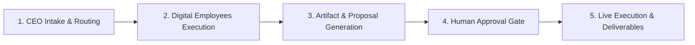

<!--
SPDX-FileCopyrightText: 2026 OpenDX CompanyOS contributors
SPDX-License-Identifier: Apache-2.0
-->

# OpenDX CompanyOS Agentic Workforce Development

This skill defines the canonical architectural standard and design patterns for building Governed AI Digital Employees (Nhân sự số) and Department Workflows within OpenDX CompanyOS.

## Core Philosophy

1. **Company is the Center**: Agents are not chatbots or free-form personas. They are governed digital staff belonging to specific functional departments (Marketing, Catalog/Merchandising, Operations/Inventory, Support/CRM, Finance).
2. **AI CEO Strategic Dispatch**: High-level strategic prompts given to the AI CEO are automatically analyzed, decomposed into structured tasks, and dispatched to the owning department workflow.
3. **Asynchronous & Non-Blocking**: Tasking one department must not block other departments or the UI. The user can dispatch tasks to multiple departments concurrently.
4. **Governed Human-in-the-Loop**: Risky actions (publishing to social media, changing public prices, issuing stock adjustments, sending mass customer emails, reconciling financial ledgers) MUST require explicit human review and approval.
5. **Verifiable Tangible Deliverables**: Every agent workflow MUST produce concrete, measurable outputs:
   - Authoritative PostgreSQL database state changes (e.g. Catalog prices updated, Inventory safety stock replenished, Support tickets resolved).
   - External platform execution (e.g. Facebook Page post published, Email dispatched).
   - Verifiable Artifacts (e.g. DOCX/PDF reports, XLSX audit logs, MinIO media assets).
   - Real-time Console UI preview and progress status.

## Standard Department Workflow Architecture

Every department workflow implements a 5-stage lifecycle:

### Stage 1: CEO Intake & Routing
- Receives user prompt from Command Center.
- Analyzes intent and matches the owning department.
- Breaks down the high-level goal into structured steps with explicit role assignments.

### Stage 2: Digital Employees Execution
- Executes specialized LLM prompts and deterministic business tools for each role (`SKILL`, `TRỢ LÝ`, `ĐỘI`).
- Enforces model budget limits, timeout bounds, and idempotency keys.

### Stage 3: Artifact & Proposal Generation
- Stores generated creative or business proposals into PostgreSQL & MinIO.
- Generates preview data for the Console UI (e.g. visual image preview, proposed price table, stock recommendation).

### Stage 4: Human-in-the-Loop Approval Gate
- Displays interactive approval UI in the Command Center:
  - **Approve (Phê duyệt)**: Triggers immediate live execution.
  - **Request Revision (Yêu cầu sửa đổi)**: Sends structured feedback back to the digital employees for another iteration.
  - **Cancel (Hủy)**: Terminates the campaign/task cleanly.

### Stage 5: Live Execution & Deliverables
- Executes authoritative actions (Meta Graph API, Storefront Database mutation, SePay ledger reconciliation).
- Applies In-Flight Concurrency Locks to prevent duplicate execution.
- Generates downloadable compliance/audit artifacts (PDF, DOCX, XLSX).

## E-Commerce Department Blueprint

| Department | Key Roles | Tangible Output / Admin Outcome |
| :--- | :--- | :--- |
| **1. Tiếp thị & Sáng tạo** *(Marketing & Creative)* | • Cây bút Tiếp thị • Thiết kế Đồ họa • Điều phối Xuất bản | • Post & 1:1 Poster live on Facebook Fanpage. • 5 downloadable deliverable artifacts (DOCX, PDF, PNG, XLSX). |
| **2. Danh mục & Định giá** *(Catalog & Pricing)* | • Cây bút Sản phẩm • Chuyên viên Định giá & Khuyến mãi | • Proposed Markdown/Promotion plan. • When approved: Instantly updates live prices, promo tags & description on Storefront. |
| **3. Vận hành & Kho vận** *(Operations & Inventory)* | • Kỹ sư Tồn kho & Dự báo • Điều phối Đơn hàng | • Stock replenishment PO draft (PDF/XLSX). • When approved: Updates safety stock thresholds in DB & resolves stuck orders. |
| **4. CSKH & Trải nghiệm** *(Support & CRM)* | • Quản gia CSKH • Chuyên viên CRM | • Abandoned cart recovery & VIP engagement draft. • When approved: Sends targeted emails/messages & closes tickets. |
| **5. Tài chính & Kiểm toán** *(Finance & Accounting)* | • Kiểm soát viên Tài chính • Chuyên viên P&L | • SePay vs Order ledger reconciliation report. • Executive P&L Financial Audit Report (PDF/XLSX). |
