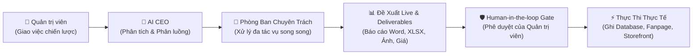

<!--
SPDX-FileCopyrightText: 2026 OpenDX CompanyOS contributors
SPDX-License-Identifier: Apache-2.0
-->

# Báo Cáo Năng Lực & Sổ Tay Kiểm Thử Lực Lượng Nhân Sự AI Số (Agentic Workforce)
**Dự án:** OpenDX CompanyOS  
**Kiến trúc:** Clean Architecture & Governed Multi-Agent Workforce  
**Mô hình cốt lõi:** AI CEO Orchestration + Google Gemini 2.5 Flash / OpenRouter  
**Cập nhật:** 2026-08-31  

---

## 📑 Mục Lục
1. [Kiến trúc Tổng quan & Cơ chế Điều phối AI CEO](#1-kiến-trúc-tổng-quan--cơ-chế-điều-phối-ai-ceo)
2. [Chi tiết 4 Phòng Ban Nhân Sự Số Đã Triển Khai](#2-chi-tiết-4-phòng-ban-nhân-sự-số-đã-triển-khai)
   - [Phòng 1: Tiếp thị & Sáng tạo nội dung (Marketing & Creative)](#phòng-1-tiếp-thị--sáng-tạo-nội-dung-marketing--creative)
   - [Phòng 2: Danh mục & Chiến lược Định giá (Catalog & Merchandising)](#phòng-2-danh-mục--chiến-lược-định-giá-catalog--merchandising)
   - [Phòng 3: Quản lý Kho & Tối ưu Vận hành (Inventory & Operations)](#phòng-3-quản-lý-kho--tối-ưu-vận-hành-inventory--operations)
   - [Phòng 4: Chăm sóc Khách hàng & Trải nghiệm CRM (Support & CRM)](#phòng-4-chăm-sóc-khách-hàng--trải-nghiệm-crm-support--crm)
3. [Bảng Ma Trận Giá Trị Đem Lại (Hệ Thống - Quản Trị Viên - Khách Hàng)](#3-bảng-ma-trận-giá-trị-đem-lại)
4. [Sổ Tay Lệnh Kiểm Chứng Cơ Sở Dữ Liệu PostgreSQL (Verification Cheatsheet)](#4-sổ-tay-lệnh-kiểm-chứng-cơ-sở-dữ-liệu-postgresql)

---

## 1. Kiến trúc Tổng quan & Cơ chế Điều phối AI CEO

OpenDX CompanyOS vận hành mô hình **Tổ chức Tự trị Có Giám sát (Governed Agentic Workforce)**. Thay vì các chatbot đơn lẻ, hệ thống xây dựng các **Phòng ban chuyên trách** với các **Nhân sự AI số (Digital Employees)** có vai trò và thẩm quyền rõ ràng.

### 🧠 Luồng Vận Hành Chuẩn 4 Bước:


1. **AI CEO Routing:** Phân tích ngôn ngữ tự nhiên từ câu chỉ đạo của Quản trị viên, tự động nhận diện phòng ban sở tại và điều phối đúng các chuyên viên AI.
2. **Asynchronous Execution:** Các nhân sự AI đọc dữ liệu thực tế từ cơ sở dữ liệu PostgreSQL để lập kế hoạch, không bịa đặt dữ liệu (Zero Hallucination).
3. **Artifacts & Deliverables:** Tự động tạo các tài liệu bàn giao nghiệp vụ (Báo cáo Word `.docx`, Bảng tính `.xlsx`, Ảnh poster `.png`, Phiếu giảm giá).
4. **Human-in-the-loop Gate (Cổng Phê Duyệt):** Bắt buộc phải có sự bấm duyệt của Quản trị viên thì các thay đổi trọng yếu (đổi giá, nhập kho, xuất bản Fanpage, chốt khiếu nại) mới được ghi nhận vào hệ thống.

---

## 2. Chi tiết 4 Phòng Ban Nhân Sự Số Đã Triển Khai

---

### Phòng 1: Tiếp thị & Sáng tạo nội dung (Marketing & Creative)

#### 👥 Đội ngũ Nhân sự Số:
* ✍️ **Chuyên viên Nội dung (Content Specialist):** Soạn thảo kịch bản copywriting, thông điệp truyền thông, tiêu đề thu hút và hashtag chuẩn nhận diện thương hiệu NovaCommerce.
* 🎨 **Chuyên viên Thiết kế (Visual Specialist):** Tạo prompt hình ảnh chuyên nghiệp và sinh poster tỉ lệ 1:1 bằng Imagen/Gemini phù hợp từng chiến dịch.
* 📢 **Chuyên viên Xuất bản (Publisher Specialist):** Điều phối đăng bài lên Facebook Fanpage thật, quản lý token, giám sát lịch sử đăng và hỗ trợ cơ chế thử lại (Retry).

#### 🧪 Cách Test:
1. Mở Console: `http://localhost:3000/agentic/tasks`.
2. Dán câu lệnh mẫu:
   ```text
   Hãy tạo chiến dịch Marketing Flash Sale giảm 30% cho bộ sưu tập Tai nghe Không dây Nova Sound Pro nhân dịp cuối tuần. Soạn nội dung Facebook và tạo hình ảnh poster
   ```
3. Bấm **Gửi** $\rightarrow$ Hệ thống tự động cuộn đến Cột 1 (Marketing & Sáng tạo).
4. Xem trước bài đăng trên mô phỏng Live Facebook Feed.
5. Bấm **`[ ✅ Phê duyệt & Đăng bài ]`**.

#### 🎯 Giá trị nhận được:
* **Hệ thống:** Ghi nhận chiến dịch vào bảng `marketing_campaigns`, bản ghi xuất bản tại `marketing_publications`, lưu trữ 5 files bàn giao (Brief `.docx`, Content `.docx`, Visual `.png`, Log `.xlsx`, Final Report `.pdf`) vào MinIO Storage.
* **Người quản trị (Admin):** Có ngay nội dung và hình ảnh truyền thông chất lượng cao trong 5 giây mà không cần thuê ngoài, kiểm soát 100% nội dung trước khi xuất bản lên Fanpage.
* **Người dùng (Khách hàng):** Nhận được thông điệp khuyến mãi hấp dẫn, rõ ràng, hình ảnh chuyên nghiệp trên mạng xã hội.

---

### Phòng 2: Danh mục & Chiến lược Định giá (Catalog & Merchandising)

#### 👥 Đội ngũ Nhân sự Số:
* 🛍️ **Chuyên viên Danh mục (Merchandising Specialist):** Rà soát toàn bộ sản phẩm trong DB, tối ưu hóa tiêu đề chuẩn SEO, viết lại mô tả sản phẩm 5 sao nêu bật thông số kỹ thuật và lợi ích khách hàng.
* 🏷️ **Chuyên viên Định giá (Pricing Specialist):** Phân tích giá vốn (`cost_price_vnd`), giá niêm yết hiện tại (`price_vnd`), tính toán biên lợi nhuận (Profit Margin) để đề xuất mức giá khuyến mãi Flash Sale tối ưu không gây lỗ.

#### 🧪 Cách Test:
1. Mở Console: `http://localhost:3000/agentic/tasks`.
2. Dán câu lệnh mẫu:
   ```text
   Phòng Danh mục hãy rà soát danh sách sản phẩm, viết lại mô tả sản phẩm chuẩn SEO và đề xuất mức giá Flash Sale giảm giá đặc biệt cho tuần lễ công nghệ
   ```
3. Bấm **Gửi** $\rightarrow$ Xem bảng so sánh giá cũ - giá mới và biên lợi nhuận dự kiến.
4. Bấm **`[ ✅ Phê duyệt & Cập nhật giá lên Storefront ]`**.

#### 🎯 Giá trị nhận được:
* **Hệ thống:** Cập nhật trực tiếp bảng `products` (tên, mô tả) và `product_variants` (`price_vnd`, `compare_at_price_vnd`), bảo toàn ràng buộc `price_vnd <= compare_at_price_vnd`.
* **Người quản trị (Admin):** Cập nhật giá và nội dung hàng loạt sản phẩm trên Storefront chỉ với 1 click, tự động tính toán biên lợi nhuận an toàn.
* **Người dùng (Khách hàng):** Trải nghiệm mua sắm trên Storefront (`http://localhost:3001`) với thông tin sản phẩm chi tiết, huy hiệu Sale đỏ nổi bật và mức giá giảm thật.

---

### Phòng 3: Quản lý Kho & Tối ưu Vận hành (Inventory & Operations)

#### 👥 Đội ngũ Nhân sự Số:
* 📦 **Điều phối viên Kho vận (Inventory Coordinator):** Rà soát số lượng tồn kho thực tế (`on_hand`), gắn cờ cảnh báo sản phẩm sắp hết hàng (`low_stock`).
* ⚙️ **Chuyên viên Tối ưu Vận hành (Operations Specialist):** Tính toán Điểm đặt hàng lại (Reorder Point - ROP) và Số lượng đặt hàng kinh tế (EOQ), đề xuất số lượng nhập kho tối ưu và lập Báo cáo Kiểm toán Kho Word `.docx`.

#### 🧪 Cách Test:
1. Mở Console: `http://localhost:3000/agentic/tasks`.
2. Dán câu lệnh mẫu:
   ```text
   Phòng Vận hành và Kho hãy kiểm toán tồn kho thực tế, cảnh báo các mặt hàng sắp hết và lập kế hoạch nhập bổ sung 50 đơn vị cho các sản phẩm bán chạy kèm báo cáo Word
   ```
3. Bấm **Gửi** $\rightarrow$ Tải Báo cáo Kiểm toán Kho `.docx`.
4. Bấm **`[ ✅ Phê duyệt & Nhập kho tự động ]`**.

#### 🎯 Giá trị nhận được:
* **Hệ thống:** Cập nhật cột `on_hand` trong bảng `inventory_items`, ghi nhật ký lịch sử di biến động kho vào `inventory_movements`, đồng bộ tồn kho hiển thị tức thời trên Storefront.
* **Người quản trị (Admin):** Nắm bắt sức khỏe chuỗi cung ứng theo thời gian thực, có báo cáo kiểm toán chuyên nghiệp để lưu trữ nội bộ, ra quyết định nhập hàng chính xác.
* **Người dùng (Khách hàng):** Không bao giờ gặp tình trạng đặt hàng nhưng bị hủy do hết kho ảo; trạng thái còn hàng/hết hàng trên web luôn chính xác 100%.

---

### Phòng 4: Chăm sóc Khách hàng & Trải nghiệm CRM (Support & CRM)

#### 👥 Đội ngũ Nhân sự Số:
* 👩‍💼 **Quản gia CSKH (Support Steward):** Đọc danh sách vé khiếu nại thực tế từ khách hàng, đánh giá chỉ số hài lòng CSAT, phân loại tâm lý (bực bội, trung lập, hài lòng), soạn kịch bản phản hồi đồng cảm 5 sao và phương án đền bù thỏa đáng.
* 🎯 **Chuyên viên CRM (CRM Specialist):** Phân tích dữ liệu lịch sử chi tiêu từ cơ sở dữ liệu `customers` và `orders`, phân khúc khách hàng (VIP Diamond, VIP Gold, At Risk) và đề xuất chiến lược giữ chân khách hàng dài hạn.

#### 🧪 Cách Test:
1. Mở Console: `http://localhost:3000/agentic/tasks`.
2. Dán câu lệnh mẫu:
   ```text
   Khách hàng phản ánh đơn hàng giao trễ 2 ngày so với lịch hẹn. Quản gia CSKH hãy tra cứu tiến độ, soạn tin nhắn xin lỗi chân thành và cấp voucher giảm 10% đền bù cho đơn hàng tiếp theo
   ```
3. Bấm **Gửi** $\rightarrow$ Xem bảng phân tích tâm lý, nguy cơ rời bỏ (Churn Risk) và kịch bản phản hồi.
4. Bấm **`[ 📥 Tải Báo Cáo Word (.docx) ]`** để tải báo cáo chăm sóc khách hàng.
5. Bấm **`[ ✅ Phê duyệt & Gửi phản hồi ticket ]`**.

#### 🎯 Giá trị nhận được:
* **Hệ thống:**
  * Bảng `support_tickets`: Chuyển trạng thái sang `resolved`, đóng mốc thời gian `sla_stopped_at`.
  * Bảng `support_ticket_messages`: Lưu trữ tin nhắn phản hồi của AI Steward (`author_id = 'support-ai-steward'`).
  * Bảng `support_ticket_events`: Ghi nhận nhật ký chuyển đổi trạng thái phục vụ kiểm toán (Audit Trail).
  * Bảng `promotions`: Tự động kích hoạt mã Voucher giảm giá thật (`CSKH10-XXXX`, `CSKH25-XXXX`...) với trạng thái `active`.
* **Người quản trị (Admin):** Xử lý hàng loạt khiếu nại trong vài giây với chuẩn mực 5 sao, giữ chân khách hàng VIP, tự động hóa quy trình bồi thường mà không cần thao tác thủ công.
* **Người dùng (Khách hàng):** Nhận được phản hồi nhanh chóng, thấu cảm và nhận ngay mã giảm giá đền bù có thể sử dụng ngay khi thanh toán đơn hàng tiếp theo.

---

## 3. Bảng Ma Trận Giá Trị Đem Lại

| Tiêu chí | 🏢 Cho Hệ Thống (OpenDX Core) | 👨‍💼 Cho Quản Trị Viên (Admin/CEO) | 🛍️ Cho Khách Hàng (Customer) |
| :--- | :--- | :--- | :--- |
| **Tiếp thị (Marketing)** | Tự động hóa pipeline tạo nội dung & MinIO artifacts; lưu vết xuất bản minh bạch. | Tiết kiệm 90% thời gian sáng tạo chiến dịch; kiểm soát bài đăng trước khi lên Fanpage. | Nhận thông điệp khuyến mãi đẹp mắt, rõ ràng và hấp dẫn trên mạng xã hội. |
| **Định giá (Merchandising)** | Đảm bảo tính toàn vẹn dữ liệu Catalog; giá niêm yết và khuyến mãi đồng bộ. | Đổi giá Flash Sale hàng loạt trong 1 giây; kiểm soát biên lợi nhuận chống bán lỗ. | Mua được sản phẩm giá tốt, thông tin mô tả chi tiết, rõ ràng, chuẩn SEO. |
| **Kho vận (Operations)** | Ghi nhận nhật ký di biến động kho (Audit Trail); đồng bộ tồn kho thời gian thực. | Cảnh báo hết hàng sớm; đề xuất số lượng nhập tối ưu; xuất báo cáo Word kiểm toán. | Tránh tình trạng đặt hàng bị hủy do hết kho ảo; nhận hàng đúng hẹn. |
| **CSKH & CRM (Support)** | Tuân thủ máy trạng thái SLA; tự động sinh Voucher chuẩn nghiệp vụ vào `promotions`. | Giải quyết khiếu nại tức thời; nhận diện khách VIP & ngăn ngừa rời bỏ (Churn). | Được lắng nghe, xin lỗi chân thành và nhận voucher đền bù thực tế để mua hàng. |

---

## 4. Sổ Tay Lệnh Kiểm Chứng Cơ Sở Dữ Liệu PostgreSQL

Quản trị viên có thể chạy trực tiếp các câu lệnh sau trong Terminal máy chủ để kiểm chứng tính toàn vẹn dữ liệu thực tế sau mỗi bài test:

### 🏷️ 1. Kiểm chứng Cập nhật Giá & Danh mục (Phòng 2):
```bash
docker exec -it opendx-companyos-postgres-1 psql -U opendx_admin -d opendx -c "
SELECT 
  p.name AS ten_san_pham, 
  pv.sku, 
  pv.price_vnd AS gia_ban_khuyen_mai, 
  pv.compare_at_price_vnd AS gia_goc_niem_yet, 
  ROUND((1.0 - pv.price_vnd::numeric / NULLIF(pv.compare_at_price_vnd, 0)) * 100, 1) AS phan_tram_giam 
FROM product_variants pv 
JOIN products p ON p.id = pv.product_id 
ORDER BY pv.updated_at DESC 
LIMIT 5;
"
```

### 📦 2. Kiểm chứng Di biến động Nhập kho (Phòng 3):
```bash
docker exec -it opendx-companyos-postgres-1 psql -U opendx_admin -d opendx -c "
SELECT 
  pv.sku, 
  im.quantity_delta AS so_luong_nhap, 
  im.reason AS ly_do_nhap, 
  im.created_at AS thoi_gian_ghi_so 
FROM inventory_movements im 
JOIN inventory_items ii ON ii.id = im.inventory_item_id 
JOIN product_variants pv ON pv.id = ii.variant_id 
ORDER BY im.created_at DESC 
LIMIT 5;
"
```

### 💬 3. Kiểm chứng Vé Khiếu nại, Tin nhắn & SLA (Phòng 4):
```bash
docker exec -it opendx-companyos-postgres-1 psql -U opendx_admin -d opendx -c "
SELECT 
  st.id, 
  c.full_name AS khach_hang, 
  st.subject AS noi_dung_khieu_nai, 
  st.status AS trang_thai, 
  st.sla_stopped_at AS gio_giai_quyet 
FROM support_tickets st 
LEFT JOIN customers c ON c.id = st.customer_id 
ORDER BY st.updated_at DESC 
LIMIT 3;
"
```

### 🎁 4. Kiểm chứng Voucher Đền bù Tự Động Kích Hoạt (Phòng 4):
```bash
docker exec -it opendx-companyos-postgres-1 psql -U opendx_admin -d opendx -c "
SELECT 
  code AS ma_voucher, 
  name AS ten_chuong_trinh, 
  percentage_bps / 100 AS phan_tram_giam, 
  fixed_amount_vnd AS so_tien_giam_vnd, 
  status AS trang_thai, 
  created_at AS ngay_tao 
FROM promotions 
ORDER BY created_at DESC 
LIMIT 3;
"
```
