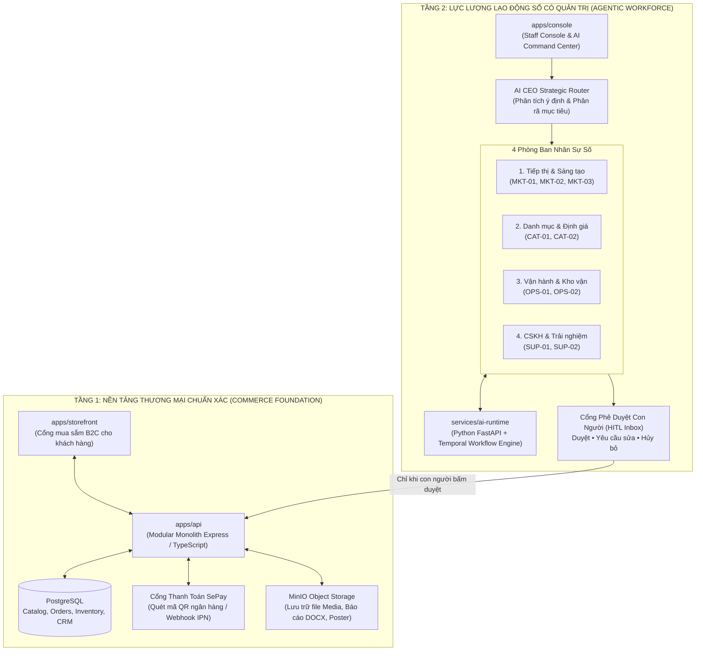
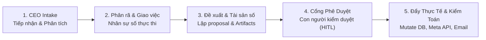
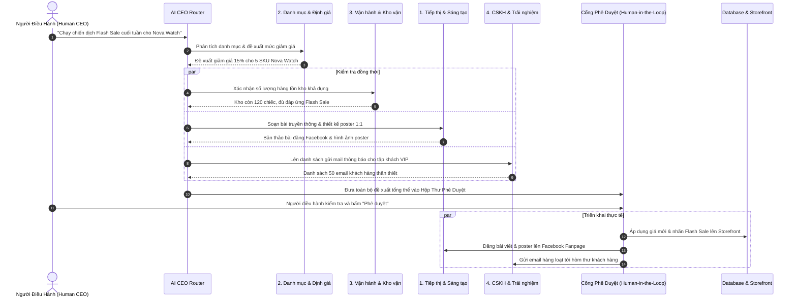

<!--
SPDX-FileCopyrightText: 2026 OpenDX CompanyOS contributors
SPDX-License-Identifier: Apache-2.0
-->

# OpenDX CompanyOS: Bản Phân Tích & Diễn Giải Chuyên Sâu Về Ý Tưởng Và Kiến Trúc Hệ Thống

---

## MỤC LỤC
1. [Bối Cảnh & Tuyên Ngôn Dự Án (Executive Manifesto)](#1-bối-cảnh--tuyên-ngôn-dự-án-executive-manifesto)
2. [Ý Tưởng Cốt Lõi: Company-First vs. Chatbot-First](#2-ý-tưởng-cốt-lõi-company-first-vs-chatbot-first)
3. [Kiến Trúc Hệ Thống 2 Tầng (Two-Tier Architecture)](#3-kiến-trúc-hệ-thống-2-tầng-two-tier-architecture)
4. [Luồng Vận Hành Toàn Diện Khép Kín (5-Stage Operational Lifecycle)](#4-luồng-vận-hành-toàn-diện-khép-kín-5-stage-operational-lifecycle)
5. [Mô Hình 4 Phòng Ban & Lực Lượng Nhân Sự Số (Governed Digital Workforce)](#5-mô-hình-4-phòng-ban--lực-lượng-nhân-sự-số-governed-digital-workforce)
6. [Cơ Chế Phối Hợp Liên Phòng Ban (Cross-Department Collaboration DAG)](#6-cơ-chế-phối-hợp-liên-phòng-ban-cross-department-collaboration-dag)
7. [Hàng Rào An Toàn & Quản Trị Rủi Ro (Guardrails & Human-in-the-Loop)](#7-hàng-rào-an-toàn--quản-trị-rủi-ro-guardrails--human-in-the-loop)
8. [Sản Phẩm Đầu Ra Hữu Hình (Tangible Deliverables & Business Value)](#8-sản-phẩm-đầu-ra-hữu-hình-tangible-deliverables--business-value)
9. [Chuẩn Mực Mã Nguồn Mở & Tiêu Chí OLP 2026](#9-chuẩn-mực-mã-nguồn-mở--tiêu-chí-olp-2026)
10. [Bản Đồ Mã Nguồn & Hướng Dẫn Vận Hành](#10-bản-đồ-mã-nguồn--hướng-dẫn-vận-hành)

---

## 1. Bối Cảnh & Tuyên Ngôn Dự Án (Executive Manifesto)

Trong kỷ nguyên bùng nổ của Trí tuệ Nhân tạo Tạo sinh (Generative AI), hầu hết các sản phẩm trên thị trường rơi vào hai thái cực:
1. **Chatbot / AI Wrapper đơn lẻ:** Người dùng mở một cửa sổ trò chuyện (như ChatGPT, Claude) để hỏi đáp. Các mô hình này thông minh nhưng bị **cô lập hoàn toàn với dữ liệu thực tế của doanh nghiệp**, dễ sinh ảo giác (hallucination), và không có khả năng thực thi các nghiệp vụ kinh doanh phức tạp.
2. **AI Agent tự do (Autonomous Playground):** Các dự án như AutoGPT hoặc CrewAI thử nghiệm cho các agent tự do gọi API và thao tác. Tuy nhiên, việc thả một agent tự do vào hệ thống quản trị nội bộ là rủi ro cực lớn: chúng có thể tự ý sửa giá sản phẩm, tự ý đặt hàng triệu USD tồn kho, hoặc gửi nhầm dữ liệu nhạy cảm ra ngoài mà không có cơ chế kiểm soát hay truy vết trách nhiệm.

Mặt khác, các hệ thống **ERP / E-Commerce truyền thống** lại quá cồng kềnh, phân mảnh và phụ thuộc nặng nề vào sức người. Một doanh nghiệp vừa và nhỏ (SMB) khi vận hành một thương hiệu bán lẻ thường xuyên bị quá tải trong các khâu: viết bài quảng cáo, thiết kế hình ảnh, tính toán chiết khấu, dự báo kho hàng và chăm sóc khách hàng.

> **OpenDX CompanyOS (DX-OS) ra đời để giải quyết bài toán đó:**  
> Đây là một **Hệ điều hành Doanh nghiệp mã nguồn mở (Open-source Company Operating System)** lấy **Doanh nghiệp làm trung tâm (Company-Centric)**, trang bị một **Lực lượng Nhân sự số có Quản trị (Governed Digital Employees)** để tự động hóa toàn diện quy trình vận hành thương mại điện tử, dưới sự giám sát và phê duyệt tuyệt đối của con người.

---

## 2. Ý Tưởng Cốt Lõi: Company-First vs. Chatbot-First

Triết lý nền tảng của OpenDX CompanyOS được gói gọn trong công thức:

```
NovaCommerce Company Core
+ Storefront (Mua sắm B2C)
+ Catalog & Kho hàng (Inventory)
+ Giỏ hàng & Khách hàng (Customer & Cart)
+ Checkout & Thanh toán thực SePay (Order & Payment)
+ CRM & Chăm sóc khách hàng (Support)
= Nền Tảng Thương Mại Chuẩn Xác (Commerce Foundation)

Nền Tảng Thương Mại Chuẩn Xác
+ AI CEO Strategic Router & Ban Điều Hành
+ 4 Phòng Ban Nhân Sự Số (Marketing, Catalog, Ops, Support)
+ Cổng Phê Duyệt Con Người (Human-in-the-Loop)
+ Sản Phẩm Hữu Hình (File Word, Meta API, Dispatch Email)
= Hệ Điều Hành Doanh Nghiệp Tự Chủ (OpenDX CompanyOS)
```

| Tiêu chí so sánh | Chatbot / Agent thông thường | OpenDX CompanyOS (DX-OS) |
| :--- | :--- | :--- |
| **Thực thể gốc (Root)** | Con Bot, Chat session hoặc LLM prompt. | **Doanh nghiệp (`Company`)**. Toàn bộ cấu trúc xoay quanh phòng ban, vai trò, mục tiêu và chính sách. |
| **Nguồn sự thật (Source of Truth)** | Trí nhớ ngữ cảnh (Context window) của LLM dễ bị quên và bịa đặt. | **PostgreSQL Database**. Dữ liệu giá bán, tồn kho, đơn hàng do backend tính toán và bảo vệ tính bất biến. |
| **Quyền hạn hành động** | Thường không có quyền, hoặc có quyền thì tự ý thực thi không kiểm soát. | **Phân quyền chặt chẽ (RBAC) + Cổng phê duyệt (HITL)**: AI chỉ lập đề xuất, con người bấm duyệt mới thay đổi hệ thống. |
| **Hình thức phối hợp** | Hỏi một câu - trả lời một đoạn văn bản. | **Điều phối liên phòng ban (Cross-Department DAG)**: AI CEO phân rã mục tiêu chiến lược và giao việc song song cho nhiều phòng ban. |
| **Kết quả bàn giao** | Dòng text trong màn hình chat. | **Sản phẩm kinh doanh hữu hình**: File báo cáo Word (.docx), poster 1:1, email gửi thật, giá cập nhật thật trên Storefront. |

---

## 3. Kiến Trúc Hệ Thống 2 Tầng (Two-Tier Architecture)

Hệ thống được tổ chức thành 2 tầng vững chắc, tuân thủ nguyên tắc **Clean Architecture** (sự phụ thuộc luôn hướng vào trong):



### Nguyên Tắc Bất Biến Của Tầng Thương Mại (Guardrails):
1. **Backend nắm quyền tối cao về giá và tồn kho:** Trình duyệt người dùng không bao giờ quyết định giá sản phẩm hay giảm giá. Mọi phép tính khuyến mãi, kiểm tra số lượng tồn, và tạo đơn đều được tính toán lại tại Backend trong một PostgreSQL Transaction.
2. **Redirect trình duyệt không chứng minh thanh toán:** Thanh toán chỉ được coi là thành công khi nhận được webhook IPN có chữ ký số xác thực từ ngân hàng đối tác (SePay), ngăn ngừa mọi nguy cơ giả mạo URL redirect.
3. **Đơn hàng là bất biến (Immutable Order Ledger):** Khi đơn hàng đã thanh toán, thông tin giá mua, địa chỉ, và chiết khấu tại thời điểm đó được lưu vĩnh viễn, không bị ảnh hưởng bởi các thay đổi giá sau này.

---

## 4. Luồng Vận Hành Toàn Diện Khép Kín (5-Stage Operational Lifecycle)

Toàn bộ hoạt động của Lực lượng Lao động Số được chuẩn hóa theo quy trình 5 giai đoạn:



### Giai Đoạn 1: Tiếp nhận Chiến lược từ Người Điều Hành (CEO Strategic Intake)
- Người quản trị doanh nghiệp gõ một mục tiêu kinh doanh vào bàn điều khiển (`CommandComposerPanel`).
- Không cần cú pháp phức tạp, chỉ cần ngôn ngữ tự nhiên:
  - *"Hãy lên chiến dịch Flash Sale cho danh mục đồng hồ thông minh và chuẩn bị bài đăng Facebook"*
  - *"Kiểm tra lượng tồn kho các mặt hàng bán chạy và tạo đề xuất nhập hàng"*
  - *"Gửi email ưu đãi giảm 20% cho toàn bộ khách hàng đã từng mua hàng"*
- **AI CEO Router** tiếp nhận, phân tích ngữ nghĩa (`Intent Detection`), và tự động xác định đây là tác vụ cục bộ của một phòng ban hay là chiến dịch cần sự hiệp đồng của nhiều phòng ban.

### Giai Đoạn 2: Phân Rã & Thực Thi Theo Vai Trò Chuyên Biệt
- Tác vụ được chuyển đến hàng đợi của từng phòng ban. Các nhân sự AI bắt đầu làm việc song song, không làm đơ giao diện hay nghẽn các phòng ban khác (`Asynchronous & Non-blocking`).
- Trạng thái suy nghĩ (`statusText`), tỷ lệ hoàn thành (`progressPercent`), và huy hiệu phối hợp (`collabTag`) được cập nhật trực tiếp trên bảng điều khiển.

### Giai Đoạn 3: Lập Đề Xuất Có Cấu Trúc & Tạo Tài Sản Số
- Nhân sự AI tạo ra các bản đề xuất chi tiết:
  - Bảng danh mục sản phẩm kèm giá cũ, giá mới, % giảm giá.
  - Bản thảo bài viết Facebook kèm hình ảnh poster vuông 1:1.
  - Danh sách email khách hàng mục tiêu kèm tiêu đề và nội dung cá nhân hóa.
  - **File báo cáo Word (.docx)** chứa toàn bộ phương án kinh doanh chi tiết.

### Giai Đoạn 4: Cổng Phê Duyệt Con Người (Human-in-the-Loop Approval Gate)
- Bản đề xuất xuất hiện trong danh sách **Chờ Phê Duyệt (Pending Approvals Panel)**.
- Người quản trị có toàn quyền:
  - **Phê duyệt (Approve):** Chấp thuận triển khai ngay.
  - **Xem & Chọn lọc:** Đối với email, người dùng có thể bỏ chọn một vài khách hàng và chỉ duyệt gửi cho các khách hàng còn lại.
  - **Hủy bỏ (Cancel) / Dừng lại (Stop):** Chấm dứt tác vụ tức thì nếu thấy không phù hợp.

### Giai Đoạn 5: Triển Khai Thực Tế & Ghi Nhật Ký Kiểm Toán (Live Mutation & Audit)
- Sau khi được duyệt, hệ thống kích hoạt các thay đổi thực tế:
  - Giá mới và banner Flash Sale xuất hiện trên Storefront NovaCommerce.
  - Bài viết và poster được đăng lên Facebook Fanpage thông qua Meta Graph API.
  - Hàng loạt email được gửi đến hòm thư thực của khách hàng.
  - Toàn bộ tiến trình được ghi nhận vào nhật ký kiểm toán bất biến (`AuditTrail & Provenance`) để minh bạch trách nhiệm.

---

## 5. Mô Hình 4 Phòng Ban & Lực Lượng Nhân Sự Số (Governed Digital Workforce)

Bốn phòng ban chức năng được thiết kế mô phỏng chính xác cấu trúc của một công ty thương mại hiện đại:

```
                                  [ AI CEO ]
                                      |
         +-----------------+----------+----------+-----------------+
         |                 |                     |                 |
[ 1. Tiếp thị & ST ]  [ 2. Danh mục & ĐG ]  [ 3. Vận hành & Kho ]  [ 4. CSKH & Trải nghiệm ]
  - MKT-01: Copy        - CAT-01: Product     - OPS-01: Inventory    - SUP-01: Support Lead
  - MKT-02: Design      - CAT-02: Pricing     - OPS-02: Orders       - SUP-02: CRM Specialist
  - MKT-03: Publish
```

### 1. Phòng Tiếp Thị & Sáng Tạo (Marketing & Creative)
- **Nhân sự:**
  - `MKT-01 (Cây bút Tiếp thị)`: Sáng tạo thông điệp, viết caption quảng cáo bắt trend.
  - `MKT-02 (Thiết kế Đồ họa)`: Phối màu, bố cục, tạo poster kích thước vuông chuẩn 1:1.
  - `MKT-03 (Điều phối Xuất bản)`: Kiểm tra tính hợp lệ của Social Token, xuất bản trực tiếp lên Facebook Page.
- **Sản phẩm đầu ra:** Bài đăng thực tế trên Facebook Fanpage kèm hình ảnh; File kế hoạch chiến dịch Marketing (.docx).

### 2. Phòng Danh Mục & Định Giá (Catalog & Pricing)
- **Nhân sự:**
  - `CAT-01 (Cây bút Sản phẩm)`: Tối ưu tên sản phẩm, viết mô tả sản phẩm chuẩn SEO.
  - `CAT-02 (Chuyên gia Định giá)`: Phân tích giá vốn, tính toán biên lợi nhuận, đề xuất mức chiết khấu Flash Sale tối ưu.
- **Sản phẩm đầu ra:** Cập nhật giá bán và huy hiệu khuyến mãi trực tiếp lên Storefront; Bảng phương án định giá (.docx / .json).

### 3. Phòng Vận Hành & Kho Vận (Operations & Inventory)
- **Nhân sự:**
  - `OPS-01 (Kỹ sư Tồn kho & Dự báo)`: Rà soát lượng hàng tồn kho an toàn, cảnh báo mặt hàng sắp hết.
  - `OPS-02 (Điều phối Đơn hàng)`: Rà soát các đơn hàng bị nghẽn thanh toán hoặc chậm giao vận.
- **Sản phẩm đầu ra:** Đề xuất đơn đặt hàng nhập kho (PO), cập nhật ngưỡng tồn kho an toàn trong cơ sở dữ liệu; Báo cáo tồn kho & xuất nhập tồn (.docx).

### 4. Phòng CSKH & Trải Nghiệm (Support & CRM)
- **Nhân sự:**
  - `SUP-01 (Quản gia CSKH)`: Phân loại và xử lý các phản ánh, khiếu nại của khách hàng.
  - `SUP-02 (Chuyên viên CRM)`: Phân khúc khách hàng (Khách mua nhiều, khách bỏ giỏ hàng, khách VIP) và soạn thảo email cá nhân hóa.
- **Sản phẩm đầu ra:** Dispatch hàng loạt email gửi tới khách hàng thực tế; Báo cáo chiến dịch Email Marketing (.docx).

---

## 6. Cơ Chế Phối Hợp Liên Phòng Ban (Cross-Department Collaboration DAG)

Điểm khác biệt lớn nhất giữa OpenDX CompanyOS và các hệ thống agent độc lập là khả năng **phối hợp đa phòng ban theo đồ thị có hướng không chu trình (DAG - Directed Acyclic Graph)**:



Toàn bộ luồng dữ liệu trên được trực quan hóa thời gian thực bằng đường cong liên kết SVG (`CrossDepartmentConnector`) trên giao diện Command Center, giúp người vận hành nắm bắt chính xác phòng ban nào đang trao đổi dữ liệu với phòng ban nào.

---

## 7. Hàng Rào An Toàn & Quản Trị Rủi Ro (Guardrails & Human-in-the-Loop)

1. **Khóa chống tranh chấp tài nguyên (In-Flight Concurrency Locks):**
   - Khi một phòng ban đang điều chỉnh một danh mục hoặc SKU, hệ thống sẽ tự động cấp một khóa tài nguyên tạm thời. Tác vụ khác muốn can thiệp vào tài nguyên đó sẽ được đưa vào danh sách chờ (`waitingTasksCount`), ngăn chặn hoàn toàn hiện tượng xung đột ghi dữ liệu (race conditions).
2. **Nút "Dừng lại" khẩn cấp (Emergency Abort Controller):**
   - Nút "Giao việc" tự động chuyển thành nút "Dừng lại" màu đỏ khi có tác vụ đang chạy. Người điều hành có thể hủy ngang tác vụ tức thì chỉ bằng một cú click chuột, giải phóng toàn bộ khóa tài nguyên và bảo toàn trạng thái trước đó.
3. **Cô lập ngữ cảnh bàn giao (Isolated Deliverable Routing):**
   - Đảm bảo khi bấm "Xem kết quả" của tác vụ CSKH thì mở đúng modal CSKH, không bị rò rỉ hay mở nhầm đề xuất của phòng Tiếp thị hay Định giá.
4. **Cơ chế Fail-Closed:**
   - Nếu xảy ra lỗi mạng, lỗi LLM, hoặc thiếu Social Token, hệ thống sẽ dừng lại ở trạng thái an toàn (Fail-Closed) thay vì cố gắng thực thi bừa bãi.

---

## 8. Sản Phẩm Đầu Ra Hữu Hình (Tangible Deliverables & Business Value)

Khác với các chatbot chỉ tạo ra câu trả lời dưới dạng text, mọi quy trình của OpenDX CompanyOS đều tạo ra các **sản phẩm kinh doanh thực tế**:

1. **Tài liệu Báo cáo Word chuẩn doanh nghiệp (.docx):**
   - Báo cáo Kế hoạch Chiến dịch Marketing.
   - Báo cáo Phương án Định giá & Flash Sale.
   - Báo cáo Đề xuất Kế hoạch Nhập kho & Dự báo Tồn kho an toàn.
   - Báo cáo Kế hoạch Chiến dịch Email CSKH.
   - Báo cáo Đối soát Tài chính SePay vs Đơn hàng (P&L Ledger).
2. **Hành động Thay đổi Hệ thống Thật:**
   - Thay đổi giá bán trực tiếp trên Storefront để khách hàng thực tế mua hàng.
   - Xuất bản bài viết và poster lên Facebook Page qua Meta Graph API.
   - Gửi email tự động tới khách hàng thực tế.
3. **Bằng chứng Kiểm toán Đầy đủ (Audit Evidence):**
   - Lưu trữ bản ghi kiểm toán bất biến: Tác vụ do ai tạo, AI nào phân tích, con người nào phê duyệt, ID của bài đăng Facebook hoặc ID giao dịch SePay tương ứng.

---

## 9. Chuẩn Mực Mã Nguồn Mở & Tiêu Chí OLP 2026

OpenDX CompanyOS được xây dựng để đáp ứng toàn bộ các tiêu chí khắt khe nhất của giải thưởng Phần mềm Nguồn mở Olympic (OLP 2026):

- **Giấy phép Chuẩn Quốc Tế:** Sử dụng giấy phép **Apache-2.0** với đầy đủ SPDX file headers trên từng file mã nguồn.
- **Chất Lượng Xây Dựng Từ Nguồn (Build-from-Source Reproducibility):** Dự án có thể clone về máy, cài đặt dependencies sạch sẽ qua `pnpm`, và chạy trọn gói bằng Docker Compose mà không phụ thuộc vào bất kỳ binary độc quyền nào.
- **Kiểm Thử Tự Động Toàn Diện:** Hệ thống sở hữu bộ kiểm thử tự động với **56 test suites (272 tests) passed 100%**, bao quát từ logic nghiệp vụ đến tích hợp thanh toán SePay và điều phối AI.
- **Quy Trình Kiểm Tra Repository Tự Động:** Script `bash scripts/audit/repo.sh` kiểm tra tính hợp lệ của license, cấu trúc thư mục, và coding standards trước mỗi commit.
- **Không Vendor-Lockin:** Hỗ trợ đa dạng các nhà cung cấp LLM thông qua OpenRouter, OpenAI, Anthropic, Google Gemini hoặc các mô hình mã nguồn mở tự host.

---

## 10. Bản Đồ Mã Nguồn & Hướng Dẫn Vận Hành

### Cấu trúc Thư mục Chính:
```
OpenDX-CompanyOS/
├── apps/
│   ├── storefront/            # Giao diện mua sắm B2C NovaCommerce (React + Vite)
│   ├── console/               # Bàn điều khiển AI Command Center (React + Vite)
│   │   └── src/features/agentic/   # Toàn bộ logic giao diện Lực lượng Nhân sự số
│   └── api/                   # Backend Modular Monolith (TypeScript + Express)
├── services/
│   └── ai-runtime/            # Python FastAPI AI Runtime & Temporal Workers
├── packages/
│   ├── domain/                # Các thực thể nghiệp vụ cốt lõi (Domain Entities)
│   ├── config/                # Cấu hình dùng chung (ESLint, TS, Tailwind)
│   └── ui/                    # Thư viện giao diện dùng chung
├── docs/                      # Tài liệu kiến trúc, API, hướng dẫn chi tiết
└── scripts/
    └── audit/repo.sh          # Script kiểm tra chuẩn nguồn mở tự động
```

### Các Lệnh Thường Dùng:
```bash
# Cài đặt toàn bộ dependencies
pnpm install

# Kiểm tra tính toàn vẹn của mã nguồn (Kiểm thử tự động)
pnpm --filter @opendx/console test

# Build ứng dụng cho môi trường production
pnpm --filter @opendx/console build

# Chạy kiểm tra chuẩn repository mã nguồn mở
bash scripts/audit/repo.sh

# Khởi chạy hệ sinh thái bằng Docker Compose
docker compose up -d
```

---

## Lời Kết

**OpenDX CompanyOS** định hình lại tương lai của việc vận hành doanh nghiệp. Dự án chứng minh rằng: **AI không sinh ra để thay thế con người, mà sinh ra để trở thành lực lượng lao động số đắc lực nhất của con người**. Bằng cách kết hợp giữa một nền tảng thương mại chuẩn xác, một ban điều hành AI linh hoạt, và một cổng phê duyệt minh bạch, OpenDX CompanyOS tạo nên một chuẩn mực mới cho **Hệ điều hành Doanh nghiệp Tự chủ Thế hệ Mới**.
