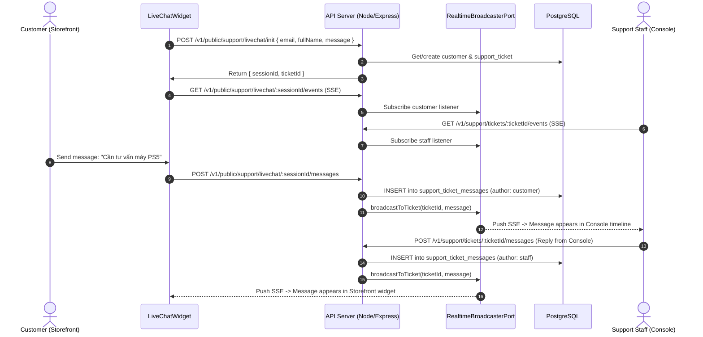

<!--
SPDX-FileCopyrightText: 2026 OpenDX CompanyOS contributors
SPDX-License-Identifier: Apache-2.0
-->

# Two-Way Realtime LiveChat Support Design Specification

## 1. Context & Business Need
In modern commerce, customers need immediate assistance when browsing products or completing purchases. In addition to asynchronous email support, OpenDX CompanyOS requires a real-time live chat channel connecting customers on the Storefront (`apps/storefront`) with customer support operators on the management Console (`apps/console`).

## 2. Requirements & Goals
- **Real-time Event Streaming**: Use Server-Sent Events (SSE) over standard HTTP without adding complex WebSocket infrastructure or third-party paid services.
- **Storefront LiveChat Widget**: Floating customer-facing widget embedded in the Storefront shell with session persistence (`sessionStorage`).
- **Clean Architecture Ports & Adapters**:
  - `RealtimeBroadcasterPort` in Application layer.
  - `InMemoryRealtimeBroadcasterAdapter` in Infrastructure layer (using `EventEmitter`).
- **Public & Internal Endpoints**:
  - `POST /v1/public/support/livechat/init`: Customer initiates session (or links to authenticated session).
  - `GET /v1/public/support/livechat/:sessionId/events`: Public SSE stream for customer.
  - `POST /v1/public/support/livechat/:sessionId/messages`: Public message ingestion.
  - `GET /v1/support/tickets/:ticketId/events`: Staff SSE stream on Console for live ticket updates.
- **OpenRouter AI Assistant (Auto-Reply & Triage)**:
  - Khi không có nhân viên trực hoặc đối với các câu hỏi thường gặp/vấn đề quan trọng, mô hình AI thông qua OpenRouter (`google/gemini-2.5-flash`) sẽ tự động phân tích ngữ cảnh và phản hồi ngay lập tức cho khách hàng qua SSE.
  - Phân loại mức độ nghiêm trọng (Urgent/High), nếu phát hiện khiếu nại nghiêm trọng (hỏng hóc, đòi hoàn tiền) sẽ tự động gắn cờ ưu tiên và báo cáo lên Console cho Trưởng bộ phận.
  - Nhân viên có thể vào tiếp quản cuộc trò chuyện bất kỳ lúc nào.
- **Bi-directional Broadcast**:
  - When customer sends a live chat message, it broadcasts to staff listening on that ticket.
  - When staff or AI sends a message, it broadcasts to the customer listening on that session/ticket via SSE.
  - When email reply arrives via IMAP, it broadcasts to staff listening on that ticket.
- **Console Real-time Updates**: Ticket detail view connects to SSE and dynamically appends messages as they occur.

## 3. Architecture & Data Flow



## 4. Technical Specifications

### 4.1 RealtimeBroadcasterPort (`apps/api/src/modules/support/application/ports/realtime-broadcaster.port.ts`)
```typescript
export interface SupportRealtimeMessageEvent {
  readonly type: "message_created";
  readonly ticketId: string;
  readonly message: {
    readonly id: string;
    readonly authorId: string;
    readonly body: string;
    readonly createdAt: string;
  };
}

export interface SupportRealtimeStatusEvent {
  readonly type: "status_changed";
  readonly ticketId: string;
  readonly status: string;
  readonly updatedAt: string;
}

export type SupportRealtimeEvent = SupportRealtimeMessageEvent | SupportRealtimeStatusEvent;

export interface RealtimeBroadcasterPort {
  subscribe(ticketId: string, listener: (event: SupportRealtimeEvent) => void): () => void;
  broadcast(ticketId: string, event: SupportRealtimeEvent): void;
}
```

### 4.2 In-Memory Broadcaster Adapter (`apps/api/src/modules/support/infrastructure/adapters/in-memory-realtime-broadcaster.adapter.ts`)
- Uses `EventEmitter` with channel pattern: `ticket:${ticketId}`.
- Manages connection heartbeats (`: keep-alive\n\n` comments every 15 seconds) to prevent proxy timeouts.
- Cleans up listeners on client disconnect (`req.on("close")`).

### 4.3 Public LiveChat Controller & Router
- `POST /v1/public/support/livechat/init`
- `GET /v1/public/support/livechat/:sessionId/events`
- `POST /v1/public/support/livechat/:sessionId/messages`
- Rate-limiting enabled via standard middleware.

### 4.4 Storefront Component (`apps/storefront/src/features/livechat/`)
- Persistent floating button and popup chat window.
- Supports unauthenticated visitors (enters name & email) and authenticated customers (pre-fills from session).
- Handles reconnection on network drops.

### 4.5 Console SSE Integration (`apps/console/src/features/support/`)
- Hook `useSupportTicketSse(apiBaseUrl, ticketId, onEvent)`.
- Updates `TicketTimeline` dynamically when `message_created` event arrives.
