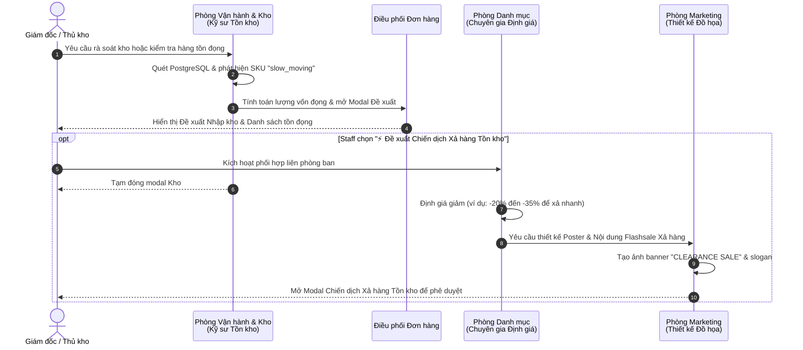

<!--
SPDX-FileCopyrightText: 2026 OpenDX CompanyOS contributors
SPDX-License-Identifier: Apache-2.0
-->

# Operations & Inventory Workforce Upgrade Design Specification

- **Date**: 2026-09-09
- **Status**: Approved
- **Author**: Antigravity AI Agent & Engineering Team
- **Target Subsystems**: `apps/console/src/features/agentic`, `apps/console/src/features/inventory`, `apps/api/src/modules/inventory`

---

## 1. Overview & Business Intent

Having successfully stabilized and validated **Tiếp thị & Sáng tạo (Marketing & Creative)** and **Danh mục & Định giá (Catalog & Merchandising)** with real-time pulsing animations, cross-department collaboration, and self-healing active campaigns, this design specifies the upgrade for **Phòng Vận hành & Kho vận (Operations & Inventory)** in OpenDX CompanyOS.

The upgrade elevates the Operations & Inventory department into an interactive, intelligent inventory auditing & replenishment copilot that:
1. Accurately analyses live stock from PostgreSQL (`on_hand`, `reserved`, `available`).
2. Provides an interactive, amber-themed replenishment modal (`OperationsProposalModal`) allowing staff to adjust restock quantities per item with real-time dynamic budget recalculation.
3. Features real-time pulsing and state transition animations for the 2 digital employees (**Kỹ sư Tồn kho** & **Điều phối Đơn hàng**).
4. Enables an optional **Cross-Department Clearance Campaign handoff**: when slow-moving / dead stock is detected, staff can trigger a handoff to **Danh mục & Định giá** and **Tiếp thị & Sáng tạo** to formulate a clearance flashsale campaign.
5. Displays a rich post-approval state inside the modal upon confirming the restock order, preserving audit trails and updating the digital workforce status.

---

## 2. Product Guardrails & Invariants

All changes must strictly adhere to the project's non-negotiable boundaries:
- **Single Warehouse / Location**: Physical goods in one internal inventory location. No multi-warehouse, external 3PL, or shipping carrier integration.
- **B2C & VND Currency**: All prices and procurement estimates are in VND (`priceMinor`).
- **Authoritative Backend Truth**: Database rows (`inventory_items`, `stock_movements`) can only be modified via transactional backend endpoints guarded by human approval.
- **Human-in-the-Loop**: Digital employees propose; humans review, adjust quantities, and approve before any stock movement is recorded.
- **Clean Architecture**: Domain and application rules remain in `apps/api/src/modules/inventory`, transport layers in presentation controllers, and UI components in `apps/console/src/features/inventory/components` and `apps/console/src/features/agentic`.

---

## 3. Digital Employees & Responsibilities

### 3.1. Kỹ sư Tồn kho (Inventory Specialist - SKILL)
- **Role Tag**: `SKILL` (Single specialized expertise).
- **Core Responsibilities**:
  - Scans PostgreSQL `inventory_items` joined with `products`, `product_variants`, and `product_prices`.
  - Calculates:
    - $\text{Available Quantity} = \max(0, \text{On-hand} - \text{Reserved})$.
    - Categorizes items into:
      - `critical_low`: Available $\le 5$ or below safety stock threshold $\rightarrow$ Red alert.
      - `slow_moving`: Available $\ge 25$ units with slow velocity $\rightarrow$ Yellow alert / Capital tied up.
      - `balanced`: Healthy inventory balance $\rightarrow$ Green state.
  - Emits alerts for supply-chain bottlenecks and stockout risks.
- **UI State**: Amber glow pulsing border (`ccAgentPulseAmber`), status dot blink (`ccDotBlink`), real-time scanning progress message.

### 3.2. Điều phối Đơn hàng (Order Coordinator - ĐỘI)
- **Role Tag**: `ĐỘI` (Coordinating team agent).
- **Core Responsibilities**:
  - Calculates recommended restock quantities:
    - For `critical_low`: $\max(10, \text{Safety Stock} \times 2 - \text{Available})$.
    - For `slow_moving` & `balanced`: Default to `0` to prevent overstocking.
  - Estimates procurement unit cost ($\sim 65\%$ of retail price).
  - Prepares the structured **Purchase Order Requisition** proposal.
  - Generates the executive Word Audit Report (`.docx`) via `generateOperationsReportDocx`.
- **UI State**: Seamless transition from Kỹ sư Tồn kho, amber glow pulsing border, status updates.

---

## 4. UI/UX Specifications (Linear Product Canvas)

### 4.1. Visual Style & Theme Synchronization
- **Color Accent**: Warm Amber (`#fbbf24`, `#f59e0b`, `rgba(251, 191, 36, 0.15)`).
- **Dark Mode**: Modal surface `#0b0f17` / `#131b2e`, borders `rgba(251, 191, 36, 0.25)`, text `#f3f4f6`.
- **Light Mode**: Modal surface `#ffffff`, borders `rgba(245, 158, 11, 0.35)`, text `#1f2937`.
- **Animations**:
  - `ccAgentPulseAmber`: 2s ease-in-out infinite box-shadow glow.
  - `ccDotBlink`: 1.2s ease-in-out infinite opacity pulse on status badge.

### 4.2. Dedicated Operations Proposal Modal (`OperationsProposalModal`)
1. **Modal Container & Backdrop**:
   - Floating modal with high z-index and blurred dark backdrop.
2. **Header & Health Summary**:
   - Department badge (Boxes icon, Amber glow).
   - Title: "Đề xuất Kiểm toán Tồn kho & Nhập hàng (+X đơn vị, Y SKU)".
   - Health summary box (blue/info) and Supply chain risk assessment (amber/danger).
3. **Filter Tabs & Quick Actions**:
   - **Filter Tabs**: `Tất cả` | `🔴 Cạn kiệt` | `🟡 Tồn đọng (Cần xả)` | `🟢 An toàn`.
   - **Quick Actions**:
     - `⚡ Nhập theo mức an toàn`: Fills recommended restock quantities for all critical_low items.
     - `🔄 Đặt tất cả về 0`: Clears all restock quantities to 0 for selective manual entry.
4. **Interactive Items Table**:
   - **Columns**: SKU | Tên sản phẩm | Tồn thực tế | Khả dụng | Trạng thái rủi ro | Số lượng nhập | Đơn giá vốn ước tính | Thành tiền dự toán.
   - **Inline Editable Restock Quantity**:
     - Number input / spinner allowing staff to adjust the quantity for each SKU directly.
     - Quantity changes immediately update:
       - Row total cost ($\text{Qty} \times \text{Unit Cost}$).
       - Table footer total units.
       - Table footer total budget.
5. **Modal Actions Footer**:
   - **📥 Tải Báo Cáo Word (.docx)**: Triggers download of formatted executive report.
   - **⚡ Đề xuất Chiến dịch Xả hàng Tồn kho (Optional)**:
     - Prominently shown when one or more `slow_moving` items exist in the proposal.
     - On click, triggers the cross-department clearance flow (see Section 5).
   - **Phê duyệt & Nhập kho**: Submits the edited restock quantities to `POST /v1/admin/inventory/ai-proposal/:id/apply`.
6. **Post-Approval Screen**:
   - Success banner: *"✅ Đã nhập kho thành công +[Tổng số lượng] đơn vị hàng vào cơ sở dữ liệu PostgreSQL"*.
   - Updated on-hand summary table.
   - Final report download button and "Đóng" button.
   - Updates the 2 Operations agents to `completed` state.

---

## 5. Cross-Department Collaboration Workflow

### 5.1. Flow: Slow-Moving Stock to Clearance Sale

---

## 6. Backend Data Integrity & API Contracts

### 6.1. Endpoint Interaction
- `POST /v1/admin/inventory/ai-proposal`: Generates inventory audit proposal with item risk classifications, safety thresholds, and recommended restock numbers.
- `POST /v1/admin/inventory/ai-proposal/:proposalId/apply`:
  - Request body: `{ items: [{ variantId: string, restockQuantity: number }] }`
  - Transactionally updates `inventory_items.on_hand` with row locking (`FOR UPDATE`) and inserts records into `stock_movements` with `reason_code: 'PO_APPROVAL'` and `actor_type: 'staff'`.
- `GET /v1/admin/inventory/ai-proposal/:proposalId/docx`: Downloads Word audit document.

### 6.2. Frontend State Management
- `isOperationsModalOpen: boolean`
- `operationsProposal: OperationsProposalDto | null`
- `editableRestockQuantities: Record<string, number>` tracking live user adjustments.
- Derived state `computedTotalUnits` and `computedTotalBudget` recalculated on every input change.

---

## 7. Testing & Verification Strategy

1. **Unit & Component Testing**:
   - Verify `OperationsProposalModal` renders accurately with risk filter tabs and quick actions.
   - Verify inline quantity editing updates the row total and footer total accurately in real-time.
   - Verify the approval button sends the modified quantities to `applyOperationsProposal`.
   - Verify cross-department clearance button dispatches into Merchandising / Marketing flow.
2. **End-to-End & Audits**:
   - Fast gate: `pnpm check:fast` (TypeScript + Lint).
   - Audit gate: `bash scripts/audit/repo.sh`.
