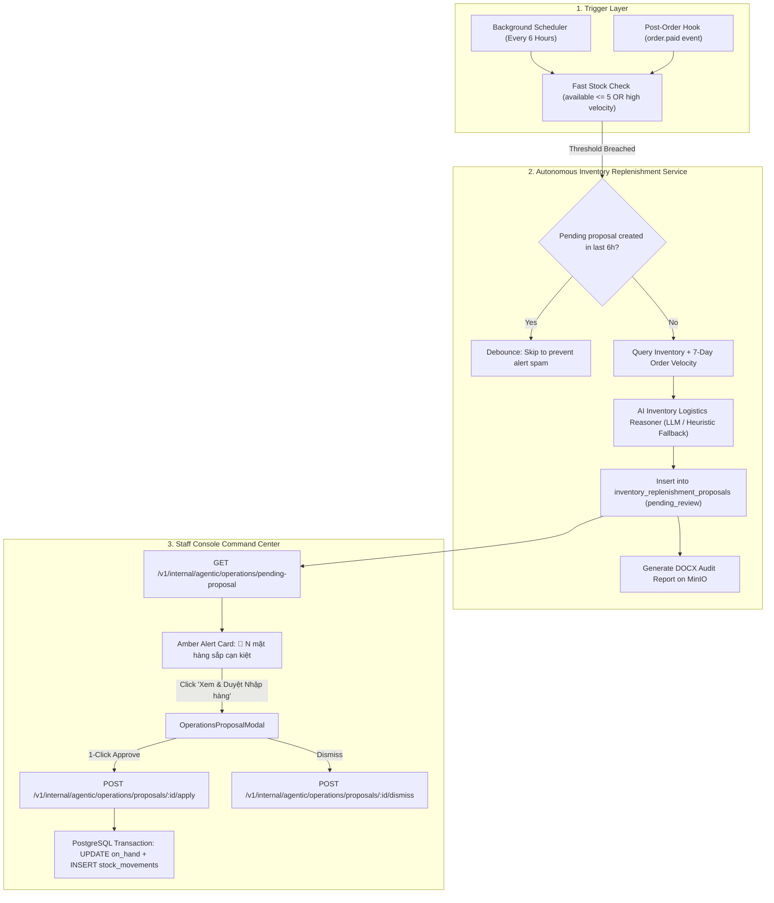

<!--
SPDX-FileCopyrightText: 2026 OpenDX CompanyOS contributors
SPDX-License-Identifier: Apache-2.0
-->

# Autonomous Proactive Inventory Replenishment Loop Design Specification

- **Date**: 2026-09-10
- **Status**: Approved
- **Author**: Antigravity AI Agent & Engineering Team
- **Target Subsystems**: `apps/api/src/modules/inventory`, `apps/console/src/features/agentic`, `apps/console/src/features/inventory`

---

## 1. Overview & Business Intent

Currently, the **Operations & Inventory (Vận hành & Kho vận)** department in OpenDX CompanyOS features interactive inventory audits and replenishment proposals when explicitly triggered by a staff operator or a high-level CEO campaign. However, under high-velocity e-commerce sales, stock for popular SKUs can deplete rapidly between manual reviews.

This specification designs an **Autonomous Proactive Inventory Replenishment Loop (Vòng lặp Tự động Giám sát Tồn kho & Gợi ý Nhập hàng)** that runs continuously in the background to:
1. Automatically monitor inventory health without waiting for manual operator requests or marketing campaigns.
2. Employ a **Dual-Trigger Mechanism**:
   - A scheduled background heartbeat executing every 6 hours (`0 */6 * * *`).
   - A post-order event hook (`order.paid`) that checks whether any SKU in a newly paid order drops below the safe available stock threshold ($\le 5$).
3. Query real-time inventory balances joined with **7-day sales velocity** from authoritative PostgreSQL order history (`order_lines`, `orders`).
4. Utilize an **AI Inventory Logistics Reasoner** (Chief Operating & Inventory Logistics Engineer) via OpenRouter LLM (with deterministic heuristic fallback) to analyze consumption trends, explain SKU depletion rationales, and formulate structured replenishment proposals.
5. Persist proposals in a dedicated PostgreSQL table `inventory_replenishment_proposals` with deduplication debouncing.
6. Present proactive amber alerts on the **Staff Command Center** (`agentic-command-center.tsx`), allowing operators to review, adjust restock quantities, and approve replenishment in 1-click via `OperationsProposalModal` while preserving strict human-in-the-loop governance.

---

## 2. Product Guardrails & Invariants

In accordance with OpenDX CompanyOS core architectural boundaries:
- **Human-in-the-Loop Financial Guardrail**: AI digital employees only analyze and propose; **risky financial actions (procurement and inventory stock mutations) require human approval**. No autonomous stock creation occurs without explicit operator confirmation.
- **Single Warehouse Constraint**: Only one physical store inventory location is tracked (`inventory_items`). No external 3PL or multi-warehouse partitioning.
- **Transactional Consistency**: All inventory stock mutations and audit events must execute within atomic PostgreSQL transactions (`transactions.run`).
- **Clean Architecture**: Domain rules stay inside `apps/api/src/modules/inventory/domain`, application services in `apps/api/src/modules/inventory/application`, and UI presentation in `apps/console/src/features/inventory` and `apps/console/src/features/agentic`.
- **Zero Hallucination / Grounded Reality**: Context passed to the LLM consists strictly of real database records (`on_hand`, `reserved`, `units_sold_7d`, `unit_price_vnd`).

---

## 3. Architecture & Data Flow



---

## 4. Data Model & Database Schema

A new database migration `202609100001_create_inventory_replenishment_proposals.ts` creates the proposal persistence table:

```sql
CREATE TABLE inventory_replenishment_proposals (
    id UUID PRIMARY KEY,
    trigger_source VARCHAR(32) NOT NULL, -- 'scheduled_cron' | 'post_order_event' | 'manual'
    status VARCHAR(32) NOT NULL DEFAULT 'pending_review', -- 'pending_review' | 'approved' | 'dismissed'
    summary TEXT NOT NULL,
    risk_assessment TEXT,
    items JSONB NOT NULL,
    total_budget_vnd BIGINT NOT NULL DEFAULT 0,
    docx_report_key VARCHAR(255),
    created_at TIMESTAMPTZ NOT NULL DEFAULT NOW(),
    updated_at TIMESTAMPTZ NOT NULL DEFAULT NOW(),
    reviewed_at TIMESTAMPTZ,
    reviewed_by VARCHAR(128)
);

CREATE INDEX idx_replenishment_pending_status
    ON inventory_replenishment_proposals(status, created_at DESC);
```

### JSONB Item Schema (`items`)
```typescript
export interface ReplenishmentProposalItem {
  readonly sku: string;
  readonly variantId: string;
  readonly productId: string;
  readonly productName: string;
  readonly categoryName: string;
  readonly onHand: number;
  readonly reserved: number;
  readonly availableQuantity: number;
  readonly recentUnitsSold7d: number;
  readonly recommendedRestockQuantity: number;
  readonly estimatedUnitCostVnd: number;
  readonly estimatedLineCostVnd: number;
  readonly actionRationale: string;
}
```

---

## 5. Dual-Trigger Mechanism

### 5.1. Background Cron Trigger (`scheduled_cron`)
- Executes on a server-side timer every 6 hours (`0 */6 * * *`).
- Performs a light SQL query verifying if any active SKU satisfies:
  $$\text{available} \le 5 \quad \text{OR} \quad \text{available} \le 2 \times \frac{\text{units\_sold\_7d}}{7}$$
- If zero SKUs qualify, the scheduler immediately terminates without calling LLMs.

### 5.2. Post-Order Event Hook (`post_order_event`)
- Hooks into `OrderService.markPaid` / `CheckoutService.completeOrder` when an order transitions to `paid`.
- Inspects only the `variant_id`s present in the completed order.
- If any purchased SKU's remaining available stock drops to $\le 5$, the replenishment evaluation is queued.

### 5.3. Debounce & Anti-Spam Guard
- A 15-minute in-memory cooldown ensures rapid successive purchases do not spam concurrent LLM evaluations.
- If a proposal in `pending_review` status already exists and was created within the past 6 hours, the system suppresses duplicate notifications unless an unrepresented SKU has newly breached critical thresholds.

---

## 6. AI LLM Context Construction & Reasoning

### 6.1. Grounded Context Query
The query combines current inventory balances with order history:
```sql
SELECT
  pv.id AS "variantId",
  p.id AS "productId",
  p.name AS "productName",
  pv.sku AS "sku",
  COALESCE(c.name, 'Linh kiện & Phụ kiện') AS "categoryName",
  COALESCE(ii.on_hand, 0) AS "onHand",
  COALESCE(ii.reserved, 0) AS "reserved",
  COALESCE(pp.amount_minor, 1000000) AS "priceMinor",
  COALESCE(sales.units_sold_7d, 0) AS "recentUnitsSold7d"
FROM product_variants pv
JOIN products p ON p.id = pv.product_id
LEFT JOIN categories c ON c.id = p.category_id
LEFT JOIN inventory_items ii ON ii.variant_id = pv.id
LEFT JOIN product_prices pp ON pp.variant_id = pv.id AND pp.valid_to IS NULL
LEFT JOIN (
  SELECT ol.variant_id, SUM(ol.quantity) AS units_sold_7d
  FROM order_lines ol
  JOIN orders o ON o.id = ol.order_id
  WHERE o.status IN ('paid', 'processing', 'ready_for_fulfillment', 'completed')
    AND o.created_at >= NOW() - INTERVAL '7 days'
  GROUP BY ol.variant_id
) sales ON sales.variant_id = pv.id
WHERE pv.status = 'active' AND p.status = 'published'
ORDER BY p.id, pv.id;
```

### 6.2. LLM System Prompt
```text
Bạn là Giám đốc Vận hành & Kỹ sư Trưởng Quản lý Kho vận (Chief Operating & Inventory Logistics Engineer) của NovaCommerce (OpenDX CompanyOS).
Nhiệm vụ: Phân tích thực trạng tồn kho và tốc độ bán hàng 7 ngày qua để tạo Đề xuất Nhập hàng Bổ sung Khẩn cấp.

Quy tắc tính toán:
1. Tồn khả dụng (Available) = Tồn thực tế (On-hand) - Tồn giữ chỗ (Reserved).
2. Phân tích tốc độ bán (recentUnitsSold7d):
   - Nếu Tồn khả dụng <= 5 HOẶC Tồn khả dụng < tốc độ bán 3 ngày: Đánh dấu "critical_low" và đề xuất nhập đủ dùng cho 14 ngày tới.
   - Viết actionRationale nêu rõ: "Đã bán X sản phẩm trong 7 ngày, hiện còn Y chiếc khả dụng. Dự kiến hết hàng trong Z ngày."
3. Giá vốn ước tính (estimatedUnitCostVnd) = 65% - 70% giá bán lẻ hiện tại.
4. Trả về định dạng JSON hợp lệ duy nhất.
```

### 6.3. Deterministic Heuristic Fallback
If `OPENROUTER_API_KEY` is missing or the external provider fails, the system executes an automated mathematical fallback:
- $\text{Daily Velocity} = \max(1, \frac{\text{recentUnitsSold7d}}{7})$.
- $\text{Recommended Restock} = \max(10, \lceil \text{Daily Velocity} \times 14 - \text{available} \rceil)$.
- Rationale: `"[Tự động]: Tồn khả dụng hiện tại (${available}) thấp hơn mức tiêu thụ dự kiến trong 14 ngày tới dựa trên dữ liệu bán hàng."`

---

## 7. Command Center UI/UX & Human Approval Gate

### 7.1. Operations Department Card Badge
In `agentic-command-center.tsx`:
- Header displays amber badge: `⚡ Đề xuất nhập kho AI: [N] SKU cần bổ sung`.
- Card body renders an **Active Alert Banner**:
  - Icon: `AlertTriangle` in glowing amber (`#f59e0b`).
  - Title: `🚨 Phát hiện N mặt hàng sắp cạn kiệt do bán chạy`.
  - Summary: Text generated by AI highlighting the most urgent SKUs.
  - Action 1 (Primary): `📋 Xem & Duyệt Nhập hàng` $\rightarrow$ Opens `OperationsProposalModal`.
  - Action 2 (Secondary): `Bỏ qua` $\rightarrow$ Calls dismissal endpoint.

### 7.2. Enhanced `OperationsProposalModal`
- Adds column / indicator: `Đã bán 7 ngày: X sản phẩm`.
- Displays individual `actionRationale` per SKU.
- Operator can adjust quantities via stepper or presets (`⚡ Nhập theo mức an toàn`, `🔄 Đặt về 0`).
- Dynamic real-time calculation of total procurement budget in VND.
- On approval: calls `POST /v1/internal/agentic/operations/proposals/:id/apply`, updates PostgreSQL `inventory_items.on_hand`, records `stock_movements`, appends audit event, and switches modal to confirmed status.

---

## 8. API Endpoints

1. `GET /v1/internal/agentic/operations/pending-proposal`
   - Returns the latest proposal with status `pending_review`, or `null` if none.
2. `POST /v1/internal/agentic/operations/trigger-replenishment-scan`
   - Manually or programmatically triggers an immediate replenishment check.
3. `POST /v1/internal/agentic/operations/proposals/:id/apply`
   - Accepts adjusted quantities: `{ items: [{ variantId: string, restockQuantity: number }] }`.
   - Transactionally increments `on_hand`, updates proposal status to `approved`, and emits audit log.
4. `POST /v1/internal/agentic/operations/proposals/:id/dismiss`
   - Marks proposal as `dismissed`.

---

## 9. Testing Strategy

1. **Migration Test**:
   - `202609100001_create_inventory_replenishment_proposals.test.ts`: Validates up/down migrations.
2. **Service Unit Tests**:
   - `ai-operations.service.test.ts`: Verifies velocity aggregation, prompt generation, heuristic fallback, and proposal caching.
   - `inventory-replenishment-monitor.service.test.ts`: Validates dual trigger, debounce cooldown, and threshold gate.
3. **Integration Tests**:
   - `inventory-replenishment.api.test.ts`: Tests `GET pending-proposal`, `POST apply`, and `POST dismiss` with database transactions.
4. **Frontend Tests**:
   - `agentic-command-center.test.tsx`: Tests rendering of the amber replenishment badge and active alert card.
   - `operations-proposal-modal.test.tsx`: Tests display of 7-day velocity, adjusting restock inputs, and clicking apply.
