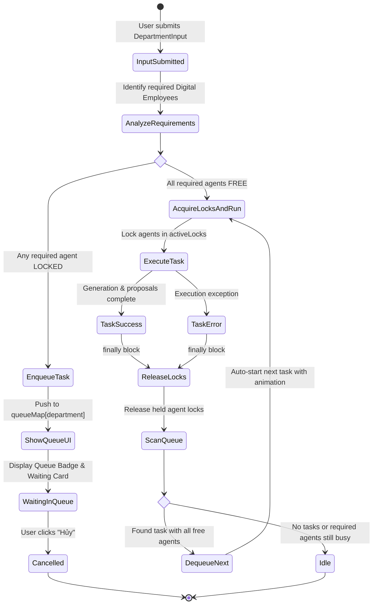

<!--
SPDX-FileCopyrightText: 2026 OpenDX CompanyOS contributors
SPDX-License-Identifier: Apache-2.0
-->

# Department Direct Task Dispatcher & Collaborative Resource Queue Design

## 1. Executive Summary & Problem Statement

In OpenDX CompanyOS, the Staff Console **Agentic Command Center** provides four specialized department columns:
- **Tiếp thị & Sáng tạo (Marketing & Creative)**
- **Danh mục & Định giá (Catalog & Merchandising)**
- **Vận hành & Kho (Operations & Inventory)**
- **CSKH & Cộng đồng (Customer Support & CRM)**

Currently, each department column features a dedicated quick task input (`<DepartmentInput />`). However, two key architectural and usability bottlenecks exist:

1. **Global Input Blocking**: Whenever an orchestration task or department workflow is active, the global `isSubmitting` flag is set to `true`, disabling every department input (`disabled={isSubmitting}`). The operator cannot assign urgent or unrelated tasks to other departments during execution.
2. **Resource Conflicts in Cross-Department Collaboration**: Several workflows require shared Digital Employees. For instance, when the **Danh mục & Định giá** department prepares a campaign, it collaborates with the **Tiếp thị & Sáng tạo** department's `Thiết kế Đồ họa (marketing_visual)` to synthesize promotional graphics. If an operator concurrently assigns a task to another department that also demands `Thiết kế Đồ họa`, direct dispatch would either overwrite state, cause race conditions, or fail unpredictably.

This specification introduces the **Department Direct Task Dispatcher & Collaborative Resource Queue (`Hàng chờ nhiệm vụ phối hợp liên phòng`)**. It enables unblocked direct task entry, parallel execution across non-overlapping resources, FIFO task queuing with visual indicators when shared digital employees are busy, and automatic dequeueing upon resource release.

---

## 2. Goals & Non-Goals

### Goals
- **Always-Available Department Inputs**: Remove global `disabled={isSubmitting}` from `<DepartmentInput />`, allowing operators to dispatch direct tasks at any time.
- **Resource Lock Matrix (`activeLocks`)**: Accurately track which Digital Employees (`marketing_visual`, `pricing_strategist`, `inventory_specialist`, etc.) are actively engaged.
- **Parallel Autonomous Execution**: Allow tasks that do not share busy resources to run immediately and concurrently across different departments.
- **Governed Department Task Queue (`queueMap`)**: When a requested task requires an agent that is currently locked by another task, safely enqueue the task in FIFO order under the requesting department.
- **Live Visual Representation**:
  - Department Header Queue Badge: Displays `⏳ Hàng chờ: N` when tasks are queued.
  - Agent Card Busy Notice: Displays `Có N nhiệm vụ đang xếp hàng chờ tài nguyên này...` on the locked agent card.
  - Department Waiting State Card: Displays queued task title, waiting notice (`Đang đợi [Tên nhân sự] hoàn tất...`), and an interactive `Hủy (Cancel)` button.
  - Smooth Auto-Dequeue Animation: Highlights tasks when transitioning from queued to running.
- **Independent Proposal Modals**: Ensure proposals from multiple departments (Marketing Fanpage, Merchandising Campaign, Operations Restock, Support Tickets) can exist side-by-side with isolated modal state triggers.
- **Error Resilience & Deadlock Prevention**: Enforce `try...finally` lock release semantics so that runtime errors or task failures always release locks and trigger the next queued task.

### Non-Goals
- Persisting in-flight UI task queues into PostgreSQL across browser refreshes (the console command center is an interactive real-time control room; long-running backend workflows remain durable in Temporal).
- Complex task prioritization or preemption (strict FIFO within each department queue is simple, predictable, and fair).
- Leaking AI model names or raw orchestration internals onto the user interface.

---

## 3. Architecture & Core Concepts

### 3.1 Digital Employee Resource Identifiers

Each department manages distinct Digital Employees, while some serve as cross-department collaborative resources:

| Department | Agent ID | Display Name | Cross-Department Collaboration |
| :--- | :--- | :--- | :--- |
| **Tiếp thị & Sáng tạo** | `marketing_copywriter` | Cây bút Sáng tạo | No |
| | `marketing_visual` | Thiết kế Đồ họa | **Yes** (Generates banners for Catalog Campaigns & Flash Sales) |
| | `marketing_publisher` | Điều phối Đăng bài | No |
| **Danh mục & Định giá** | `catalog_copywriter` | Cây bút Sản phẩm | No |
| | `pricing_strategist` | Chuyên gia Định giá | **Yes** (Calculates clearance margin for Operations) |
| **Vận hành & Kho** | `inventory_specialist` | Kỹ sư Tồn kho | **Yes** (Audits SKU stock for Clearance Campaign) |
| | `order_coordinator` | Điều phối Đơn hàng | No |
| **CSKH & Cộng đồng** | `support_steward` | Quản gia CSKH | No |
| | `crm_specialist` | Chuyên viên CRM | No |

### 3.2 Data Models

```typescript
export type DepartmentType = "marketing" | "merchandising" | "operations" | "support";

export type TaskStatus = "queued" | "running" | "completed" | "failed" | "cancelled";

export interface DepartmentTask {
  id: string;
  department: DepartmentType;
  prompt: string;
  requiredAgents: string[];
  status: TaskStatus;
  waitingForResource?: {
    agentId: string;
    agentName: string;
    heldByDepartment: DepartmentType;
    taskPromptSnippet: string;
  };
  queuedAt: number;
  startedAt?: number;
  completedAt?: number;
  error?: string;
}

export interface ResourceLock {
  agentId: string;
  lockedByTaskId: string;
  lockedByDepartment: DepartmentType;
  lockedAt: number;
}
```

### 3.3 Resource Lock Matrix & Queue State Machine

The Command Center maintains:
- `activeLocks: Record<string, ResourceLock>`: Keyed by `agentId`.
- `queueMap: Record<DepartmentType, DepartmentTask[]>`: Keyed by department.
- `runningTasks: Record<string, DepartmentTask>`: Keyed by `taskId`.



### 3.4 Dequeue and Lock Resolution Algorithm

When locks are released in `releaseLocks(agentIds: string[])`:
1. Delete keys matching `agentIds` from `activeLocks`.
2. Iterate through departments (`marketing`, `merchandising`, `operations`, `support`) in round-robin order to ensure cross-department fairness.
3. For each department, inspect the queue in FIFO order (`queueMap[dept][0]`).
4. Check whether all `task.requiredAgents` are now free in `activeLocks`.
5. If free:
   - Dequeue the task (`queueMap[dept].shift()`).
   - Acquire locks for its `requiredAgents`.
   - Update its status to `"running"` and trigger its execution handler with a visual transition.
6. Continue scanning until no queued task can be satisfied with current available locks.

---

## 4. UI/UX Specifications (Linear Product Canvas)

All visual elements strictly follow the **Linear-inspired operational canvas**:
- Canvas background: `#010102`.
- Border lines: Subtle `#1f242d` or theme-tinted 1px borders.
- Department Accent Themes:
  - Tiếp thị & Sáng tạo: Blue (`#3b82f6`)
  - Danh mục & Định giá: Cyan (`#06b6d4`)
  - Vận hành & Kho: Amber (`#fbbf24`)
  - CSKH & Cộng đồng: Emerald (`#10b981`)
- Typography: Dense, clear, uppercase micro-labels (`font-size: 11px`, `letter-spacing: 0.05em`).

### 4.1 Department Header Queue Badge
When `queueMap[dept].length > 0`, the header displays a compact queue badge next to the personnel count:
```tsx
<div className="ccDeptQueueBadge">
  <Clock size={12} className="ccSpinSlow" />
  <span>Hàng chờ: {queuedCount}</span>
</div>
```
Style:
- Background: `rgba(245, 158, 11, 0.12)`
- Text color: `#fbbf24`
- Border: `1px solid rgba(245, 158, 11, 0.25)`
- Border radius: `9999px`
- Padding: `2px 8px`

### 4.2 Agent Card Waiting Notice Box
If an Digital Employee is currently locked and there are tasks in the queue waiting for this specific agent, the `AgentCard` displays a small waiting indicator below its current status:
```tsx
{waitingCount > 0 && (
  <div className="ccAgentQueueNotice">
    <Hourglass size={11} />
    <span>{waitingCount} nhiệm vụ đang chờ nhân sự này</span>
  </div>
)}
```

### 4.3 Department Waiting State Card
When a department has a task currently waiting in the queue, a waiting card appears above the `<DepartmentInput />`:
```tsx
<div className="ccDepartmentWaitingCard">
  <div className="ccWaitingCardHeader">
    <div className="ccWaitingCardTitle">
      <Clock size={13} className="ccPulseOrange" />
      <span>Nhiệm vụ đang xếp hàng</span>
    </div>
    <button 
      type="button" 
      className="ccWaitingCancelBtn"
      onClick={() => handleCancelQueuedTask(task.id)}
      title="Hủy nhiệm vụ khỏi hàng chờ"
    >
      <X size={12} />
      <span>Hủy</span>
    </button>
  </div>
  <p className="ccWaitingCardPrompt">"{task.prompt}"</p>
  <div className="ccWaitingCardResource">
    <span className="ccWaitingDot" />
    <span>Đang đợi {task.waitingForResource?.agentName || "nhân sự phối hợp"} hoàn tất việc...</span>
  </div>
</div>
```

### 4.4 Auto-Dequeue Transition Animation
When a queued task is dequeued and begins execution:
- The card triggers a subtle entry highlight animation (`@keyframes ccHighlightStart`):
  - 0%: background flash `rgba(94, 106, 210, 0.2)`
  - 100%: smooth fade to default department background.
- Immediate update of the department agent's card status to `"running"` with the live activity message.

### 4.5 Independent Department Proposals & Modal Separation
To prevent modal stacking or state collision, each department retains its independent proposal presentation:
- **Tiếp thị (Marketing)**: `activeCampaignDetail` and publication revision controls.
- **Danh mục (Merchandising)**: `campaignProposal` rendered with `CampaignProposalModal`.
- **Vận hành (Operations)**: `operationsProposal` rendered with `OperationsProposalModal`.
- **CSKH (Support)**: `supportProposal` rendered with `SupportProposalModal` and Word download.

Each department's proposal button operates independently, without disabling or hiding proposals in other columns.

---

## 5. Implementation Plan & State Structure

### 5.1 New State Variables in `AgenticCommandCenter`

```typescript
// Queue State
const [departmentQueues, setDepartmentQueues] = useState<Record<DepartmentType, DepartmentTask[]>>({
  marketing: [],
  merchandising: [],
  operations: [],
  support: [],
});

// Resource Locks State
const [activeLocks, setActiveLocks] = useState<Record<string, ResourceLock>>({});

// Running Tasks State
const [runningDeptTasks, setRunningDeptTasks] = useState<Record<string, DepartmentTask>>({});
```

### 5.2 Dependency Mapping Table

```typescript
const TASK_AGENT_DEPENDENCIES: Record<string, { primaryDept: DepartmentType; requiredAgents: string[] }> = {
  marketing_default: {
    primaryDept: "marketing",
    requiredAgents: ["marketing_copywriter", "marketing_visual", "marketing_publisher"],
  },
  merchandising_campaign: {
    primaryDept: "merchandising",
    requiredAgents: ["catalog_copywriter", "pricing_strategist", "marketing_visual"],
  },
  merchandising_quick: {
    primaryDept: "merchandising",
    requiredAgents: ["catalog_copywriter", "pricing_strategist"],
  },
  operations_restock: {
    primaryDept: "operations",
    requiredAgents: ["inventory_specialist", "order_coordinator"],
  },
  operations_clearance: {
    primaryDept: "operations",
    requiredAgents: ["inventory_specialist", "pricing_strategist", "marketing_visual"],
  },
  support_default: {
    primaryDept: "support",
    requiredAgents: ["support_steward", "crm_specialist"],
  },
};
```

### 5.3 Lock Helper Methods

```typescript
// Check if agents are locked
const getConflictingLocks = (requiredAgents: string[]) => {
  return requiredAgents
    .map((agentId) => activeLocks[agentId])
    .filter(Boolean);
};

// Acquire locks
const acquireLocks = (taskId: string, dept: DepartmentType, agents: string[]) => {
  const now = Date.now();
  const newLocks: Record<string, ResourceLock> = {};
  agents.forEach((agentId) => {
    newLocks[agentId] = {
      agentId,
      lockedByTaskId: taskId,
      lockedByDepartment: dept,
      lockedAt: now,
    };
  });
  setActiveLocks((prev) => ({ ...prev, ...newLocks }));
};

// Release locks and auto-dequeue
const releaseLocks = (agents: string[]) => {
  setActiveLocks((prev) => {
    const updated = { ...prev };
    agents.forEach((a) => delete updated[a]);
    return updated;
  });
  // Auto-scan queue in subsequent effect or immediate tick
};
```

---

## 6. Error Resilience & Deadlock Prevention

1. **Guaranteed Lock Release**: All execution routines run inside `try ... finally` blocks. Whether a task succeeds, times out, or encounters a network error, locks are strictly released in `finally`.
2. **Orphan Lock Reclamation**: In case of unexpected component lifecycle interruptions, an idle watchdog clears locks that exceed a safety threshold (e.g., 3 minutes) if no network traffic or agent progress was observed.
3. **Queue Cancellation**: Operators can cancel any task in the queue via the `Hủy` button. Cancellation immediately removes the item from `queueMap` and refreshes the queue counter without altering active locks.
4. **Independent Scopes**: Submitting a direct task to one department never cancels or overwrites a proposal generated by another department.

---

## 7. Verification & Acceptance Testing Plan

| # | Test Scenario | Steps | Expected Result |
| :--- | :--- | :--- | :--- |
| **TC-1** | **Direct Input Unblocking** | Start a Marketing Campaign. While running, click the Operations and Support input fields. | Both input fields remain fully enabled; typing and submitting works without interruption. |
| **TC-2** | **Independent Parallel Execution** | While Operations is running a restock task (`inventory_specialist`, `order_coordinator`), submit a Support task (`support_steward`, `crm_specialist`). | Both tasks execute simultaneously; both columns show active status indicators and progress bars. |
| **TC-3** | **Resource-Constrained Queuing** | While Marketing is using `marketing_visual`, submit a Merchandising Campaign task (which also requires `marketing_visual`). | Merchandising does not block or error; it transitions into `queued` state. Header shows `⏳ Hàng chờ: 1`. Waiting card appears with waiting notice. |
| **TC-4** | **Queue Notice on Busy Agent** | Inspect the Marketing `Thiết kế Đồ họa` card during TC-3. | Agent card shows badge: `1 nhiệm vụ đang chờ nhân sự này`. |
| **TC-5** | **Auto-Dequeue on Lock Release** | Allow the Marketing task to complete its visual design step. | Locks for `marketing_visual` are released. Merchandising task automatically dequeues, changes to `running`, and begins executing its workflow. |
| **TC-6** | **Manual Queue Cancellation** | Enqueue a task, then click the `Hủy` button on the department waiting card. | Task is removed from queue; header queue badge disappears; no unreleased locks remain. |
| **TC-7** | **Simultaneous Proposals** | Produce a Merchandising Campaign Proposal and an Operations Restock Proposal at the same time. | Both review buttons are visible; clicking one opens its specific modal; closing it leaves the other proposal intact and accessible. |
| **TC-8** | **Error Resilience** | Trigger a task that encounters an API error. | Error is reported; locks are guaranteed released via `finally`; subsequent queued tasks proceed normally. |
