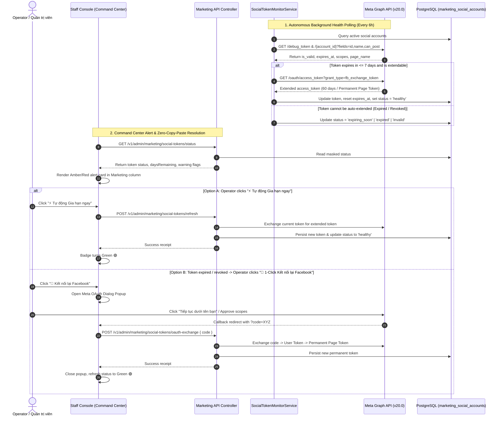

<!--
SPDX-FileCopyrightText: 2026 OpenDX CompanyOS contributors
SPDX-License-Identifier: Apache-2.0
-->

# Social Token Expiration & Health Monitor Design Specification

- **Date**: 2026-09-10
- **Status**: Draft (Awaiting Review)
- **Author**: Antigravity AI Agent & Engineering Team
- **Target Subsystems**: `apps/api/src/modules/marketing`, `apps/console/src/features/marketing`, `apps/console/src/features/agentic`

---

## 1. Overview & Business Intent

Currently, the **Marketing & Communications (Phòng Marketing & Truyền thông)** department in OpenDX CompanyOS automatically generates, visualizes, and publishes campaign packages to social platforms (Facebook and Instagram). However, access credentials (Meta Page Access Tokens and Instagram Graph Tokens) can silently expire or lose permissions over time (typically 60-day lifespan for user tokens, or when administrative credentials/passwords change).

When this occurs, scheduled campaign publication abruptly halts with errors (`FACEBOOK_TOKEN_INVALID`, `INSTAGRAM_TOKEN_INVALID`), degrading autonomous operations and requiring emergency debugging.

This specification designs an **Autonomous Social Token Expiration & Health Monitor (Tiểu dự án B: Giám sát Sức khỏe & Tự động Gia hạn Token Social)** to:
1. **Continuously & Proactively Monitor Token Health**: Periodically inspect Meta Graph API tokens in the background (every 6 hours) and compute remaining validity in days.
2. **Early Warning Thresholds**:
   - 🟢 **Healthy**: Valid token with $> 7$ days remaining or permanent never-expiring Page Token.
   - 🟡 **Expiring Soon (Warning)**: Valid token with $\le 7$ days remaining.
   - 🔴 **Critical / Expired / Invalid**: Token with $< 3$ days remaining, revoked permissions, or expired session (error code 190).
3. **Zero-Copy-Paste Automated Refresh (2-Tier Resolution)**:
   - **Tier 1 (1-Click Auto-Extend via `fb_exchange_token`)**: Uses Meta's server-to-server token extension endpoint to automatically renew valid tokens for an additional 60 days and fetch refreshed permanent Page Access Tokens without operator copying or pasting anything.
   - **Tier 2 (1-Click Meta OAuth Popup)**: If the token has completely expired or was revoked due to a password reset, the operator clicks `🔗 Kết nối lại Facebook`. A standard Meta OAuth authorization window opens; upon clicking "Tiếp tục / Cho phép", the authorization code is automatically received, exchanged, and applied directly to the database and publisher runtime.
4. **Autonomous Background Auto-Renewal**: When background checks detect a token with $\le 7$ days remaining, the system attempts background `fb_exchange_token` renewal before triggering user warnings.
5. **Staff Command Center Integration**: Clear visual indicators (pulsing amber/red header badges and proactive alert cards) in the Marketing department column on `agentic-command-center.tsx`, complete with a dedicated `SocialTokenManagerModal`.

---

## 2. Product Guardrails & Invariants

In accordance with OpenDX CompanyOS core architectural boundaries:
- **Security & Token Redaction**: Access tokens are confidential credentials. They must **never** appear in plaintext logs, audit messages, or public API responses. All public representations must be masked (e.g. `EAAB...wxyz` or `[REDACTED]`).
- **Clean Architecture**: Domain entities and rules must not depend on external SDKs or direct fetch calls. All Meta Graph network interactions are isolated behind port interfaces (`SocialTokenInspectorPort`, `SocialTokenRefresherPort`).
- **Database As Primary Truth with Environment Fallback**: The database table `marketing_social_accounts` serves as the authoritative credential store. If the table is empty during boot, existing environment variables (`FACEBOOK_PAGE_ACCESS_TOKEN`, `INSTAGRAM_ACCESS_TOKEN`) are imported and verified automatically.
- **Fail-Closed Principle**: If token validity cannot be proven during a publication attempt, the system fails closed gracefully with clear diagnosis rather than corrupting campaign states.

---

## 3. Architecture & Data Flow



---

## 4. Database Schema Design

A new migration `202609100002_create_marketing_social_accounts.ts` creates the `marketing_social_accounts` table:

```sql
CREATE TABLE marketing_social_accounts (
  id uuid PRIMARY KEY,
  platform text NOT NULL CHECK (platform IN ('facebook', 'instagram')),
  account_id text NOT NULL CHECK (length(btrim(account_id)) BETWEEN 1 AND 255),
  account_name text NOT NULL CHECK (length(btrim(account_name)) BETWEEN 1 AND 255),
  access_token text NOT NULL CHECK (length(btrim(access_token)) >= 10),
  token_type text NOT NULL DEFAULT 'bearer',
  token_status text NOT NULL CHECK (token_status IN (
    'healthy', 'expiring_soon', 'expired', 'invalid', 'unconfigured'
  )),
  token_expires_at timestamptz,
  data_access_expires_at timestamptz,
  scopes jsonb NOT NULL DEFAULT '[]'::jsonb,
  is_long_lived boolean NOT NULL DEFAULT false,
  last_checked_at timestamptz,
  last_error text,
  metadata jsonb NOT NULL DEFAULT '{}'::jsonb,
  created_at timestamptz NOT NULL DEFAULT now(),
  updated_at timestamptz NOT NULL DEFAULT now(),
  CONSTRAINT marketing_social_accounts_platform_account_id_key UNIQUE (platform, account_id)
);

CREATE INDEX idx_social_accounts_status ON marketing_social_accounts(token_status);
CREATE INDEX idx_social_accounts_expires ON marketing_social_accounts(token_expires_at);
```

---

## 5. Domain Models & DTOs

### 5.1 Entities (`apps/api/src/modules/marketing/domain/entities/social-account.ts`)
```typescript
export type SocialTokenStatus =
  | "healthy"
  | "expiring_soon"
  | "expired"
  | "invalid"
  | "unconfigured";

export interface SocialAccountEntity {
  readonly id: string;
  readonly platform: "facebook" | "instagram";
  readonly accountId: string;
  readonly accountName: string;
  readonly accessToken: string;
  readonly tokenType: string;
  readonly tokenStatus: SocialTokenStatus;
  readonly tokenExpiresAt?: string;
  readonly dataAccessExpiresAt?: string;
  readonly scopes: readonly string[];
  readonly isLongLived: boolean;
  readonly lastCheckedAt?: string;
  readonly lastError?: string;
  readonly metadata: Record<string, unknown>;
  readonly createdAt: string;
  readonly updatedAt: string;
}
```

### 5.2 Public DTOs (`apps/api/src/modules/marketing/application/dtos/social-token.dto.ts`)
```typescript
export interface SocialTokenHealthView {
  readonly platform: "facebook" | "instagram";
  readonly accountId: string;
  readonly accountName: string;
  readonly maskedToken: string; // e.g. "EAAB...4xyz"
  readonly tokenStatus: SocialTokenStatus;
  readonly daysRemaining?: number;
  readonly tokenExpiresAt?: string;
  readonly isLongLived: boolean;
  readonly scopes: readonly string[];
  readonly lastCheckedAt?: string;
  readonly lastError?: string;
  readonly requiresAction: boolean;
  readonly actionType?: "auto_refresh" | "oauth_reconnect";
}

export interface SocialTokensSummaryView {
  readonly accounts: readonly SocialTokenHealthView[];
  readonly overallStatus: "healthy" | "warning" | "critical";
  readonly activeAlertCount: number;
  readonly alertMessage?: string;
}
```

---

## 6. Ports & Infrastructure Adapters

### 6.1 Token Inspection & Refresh Ports
```typescript
export interface SocialTokenInspectionResult {
  readonly isValid: boolean;
  readonly accountId: string;
  readonly accountName: string;
  readonly expiresAt?: string; // null if never expires
  readonly dataAccessExpiresAt?: string;
  readonly scopes: readonly string[];
  readonly isLongLived: boolean;
  readonly error?: string;
}

export interface SocialTokenInspectorPort {
  inspectToken(
    platform: "facebook" | "instagram",
    token: string,
    accountId: string,
  ): Promise<SocialTokenInspectionResult>;
}

export interface SocialTokenRefresherPort {
  extendToken(
    platform: "facebook" | "instagram",
    currentToken: string,
    appId: string,
    appSecret: string,
  ): Promise<{ accessToken: string; expiresInSeconds?: number }>;

  exchangeOAuthCode(
    platform: "facebook" | "instagram",
    code: string,
    redirectUri: string,
    appId: string,
    appSecret: string,
    targetPageId?: string,
  ): Promise<{
    userAccessToken: string;
    pageAccessToken: string;
    pageId: string;
    pageName: string;
    expiresInSeconds?: number;
  }>;
}
```

### 6.2 Adapter Implementation
- `MetaGraphSocialTokenAdapter`: Calls Meta Graph `/debug_token` and `/oauth/access_token`.
- Automatically sanitizes tokens in exception traces.

---

## 7. Application Services & Monitor Worker

1. **`SocialTokenManagerService`**:
   - `getTokensSummary()`: Returns sanitized health views with warning badges.
   - `performHealthCheck()`: Scans all registered accounts, updates DB with live inspection results.
   - `autoRefreshAccount(accountId)`: Invokes `fb_exchange_token` to extend validity by 60 days or fetch permanent Page Token.
   - `handleOAuthCallback(code, redirectUri)`: Exchanges authorization code from 1-Click popup into active Page Access Token, updates DB, and triggers immediate health check.
   - `seedFromEnvironmentIfEmpty()`: Reads `.env` fallback on boot to populate DB if uninitialized.

2. **`AutonomousSocialTokenMonitorService`**:
   - Runs periodic check every 6 hours (`0 */6 * * *`).
   - If a token is within 7 days of expiration, attempts autonomous Tier 1 `autoRefreshAccount`.
   - If auto-refresh succeeds: logs success, token extended silently.
   - If auto-refresh fails or requires user re-authorization: flags account as `expiring_soon` or `invalid`, making Command Center alert active.

---

## 8. Admin API Endpoints

| Method | Endpoint | Description | Role / Auth |
|---|---|---|---|
| `GET` | `/v1/admin/marketing/social-tokens/status` | Get health summary of all configured social tokens | Staff Principal (`marketing:view`) |
| `POST` | `/v1/admin/marketing/social-tokens/refresh` | 1-Click Auto-Extend token via `fb_exchange_token` | Staff Principal (`marketing:manage`) |
| `POST` | `/v1/admin/marketing/social-tokens/oauth-exchange` | 1-Click OAuth callback code exchange | Staff Principal (`marketing:manage`) |
| `POST` | `/v1/admin/marketing/social-tokens/check` | On-demand trigger health inspection scan | Staff Principal (`marketing:manage`) |

---

## 9. Staff Console UX Design

### 9.1 Header Badge in Marketing Department Column
- **Healthy**: `🟢 Social Token: OK` (Green subtle tag).
- **Expiring Soon ($\le 7$ days)**: `⚡ Token FB hết hạn sau X ngày` (Pulsing Amber tag).
- **Critical ($< 3$ days or Expired)**: `🚨 Token FB đã hết hạn / lỗi` (Pulsing Red tag).

### 9.2 Command Center Alert Card (`agentic-command-center.tsx`)
Rendered directly inside `#dept-column-marketing`:
- When status is `expiring_soon`:
  - Amber bordered card with alert icon.
  - Text: `⚠️ Token Facebook sắp hết hạn sau {daysRemaining} ngày. Vui lòng làm mới để tránh gián đoạn chiến dịch.`
  - Action button: `[⚡ Tự động Gia hạn ngay]` (calls `/refresh` endpoint -> instant green badge without copying/pasting).
- When status is `expired` or `invalid`:
  - Red bordered card with warning icon.
  - Text: `🚨 Token Facebook đã hết hạn hoặc bị thu hồi quyền đăng bài.`
  - Action button: `[🔗 1-Click Kết nối lại Facebook]` (opens Meta OAuth popup -> exchanges code -> instant green badge).

### 9.3 Modal `SocialTokenManagerModal`
- Lists Facebook & Instagram accounts with Page names, Page IDs, masked token, expiration countdown, and live permissions (`pages_manage_posts`, `instagram_basic`).
- Provides 1-Click "Kiểm tra kết nối" and "Gia hạn tự động".

---

## 10. Verification & Test Plan

1. **Unit & Contract Tests**:
   - `social-token-inspector.adapter.test.ts`: Tests `/debug_token` parsing, expiration calculation, and Meta Graph error code 190 mapping.
   - `social-token-refresher.adapter.test.ts`: Tests `fb_exchange_token` extension and OAuth code exchange logic.
   - `social-token-manager.service.test.ts`: Tests auto-refresh, environment seeding, and fallback behavior.
   - `autonomous-social-token-monitor.service.test.ts`: Tests scheduled 6-hour cron and automatic renewal threshold execution.
2. **API Route Tests**:
   - `social-tokens.api.test.ts`: Verifies `/status`, `/refresh`, `/oauth-exchange`, and `/check` endpoints with RBAC.
3. **Console UI Component Tests**:
   - `social-token-alert.test.tsx`: Tests rendering of Amber / Red alert cards and header badges.
   - Tests 1-click refresh handler and popup message listener.
