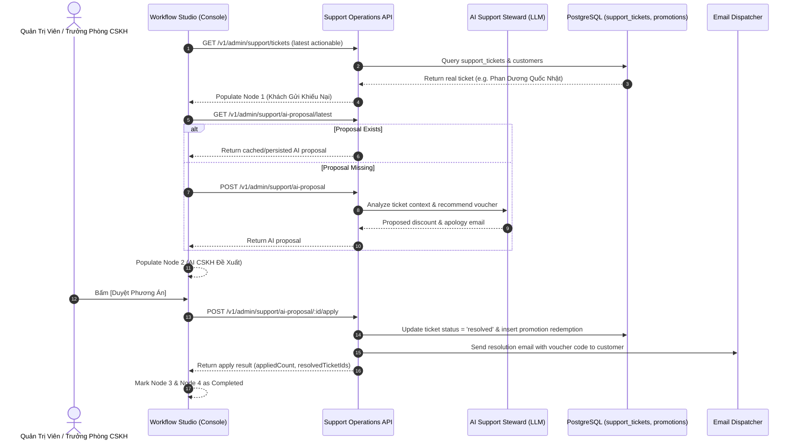

<!--
SPDX-FileCopyrightText: 2026 OpenDX CompanyOS contributors
SPDX-License-Identifier: Apache-2.0
-->

# Design Spec: Live Backend Integration for Visual Customer Recovery Workflow

## 1. Context & Objectives

The Visual Business Workflow Studio (`apps/console/src/features/workflows`) currently models the canonical **Workflow 2: Customer Recovery & Complaint Resolution (WF-CSKH-RECOVERY)** using interactive local state fixtures.

To achieve production-grade operability, this spec defines how the visual workflow connects directly to authoritative backend services in `apps/api/src/modules/support` and `apps/api/src/modules/agentic`:
1. **Node 1 (Inbound Event)**: Reads real unresolved customer complaint tickets from the PostgreSQL database via `SupportOperationsApi.list()`.
2. **Node 2 (AI Analysis)**: Loads or generates real AI analysis from `AiSupportService` via `SupportOperationsApi.getLatestSupportProposal()` or `generateSupportProposal()`.
3. **Node 3 (Approval Gate)**: Submits real human approval mutations via `SupportOperationsApi.applySupportProposal(proposalId, items)`.
4. **Node 4 (Execution Action)**: Confirms verified backend resolution, coupon voucher activation in `promotions`, and outbound email resolution via `EmailDispatcherPort`.

---

## 2. Architecture & Data Flow

---

## 3. UI Graceful Degradation & Fallback Strategy

To ensure zero downtime, testing stability, and offline resilience:
- When `supportApi` is provided and the backend API is reachable:
  - The Studio loads live tickets and proposals.
  - Live data hydrates Node 1 and Node 2.
  - Real approval executes via the API.
- When `supportApi` is omitted (e.g. in standalone unit tests) or the network is unavailable:
  - The Studio automatically falls back to `CUSTOMER_RECOVERY_WORKFLOW_FIXTURE`.
  - An informational indicator (`Chế độ mô phỏng`) is displayed.
  - Operators can still test the flow completely without errors.

---

## 4. Verification & Testing Gate

1. **Unit & Component Testing**:
   - Verify `WorkflowStudioPage` renders real ticket data when `supportApi` returns valid data.
   - Verify fallback to fixture when `supportApi` is not supplied.
   - Verify approval button triggers `supportApi.applySupportProposal`.
2. **Build Verification**:
   - `pnpm --filter @opendx/console build` must succeed with zero errors.
   - Vitest test suite passes with 100% coverage on workflow features.
