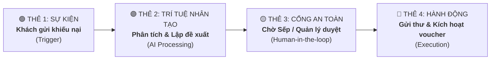

<!--
SPDX-FileCopyrightText: 2026 OpenDX CompanyOS contributors
SPDX-License-Identifier: Apache-2.0
-->

# Visual Business Workflow Studio & Customer Recovery Workflow Design Spec

## 1. Executive Summary & Problem Statement

Modern integration and workflow platforms (e.g., n8n, Zapier) suffer from an **IT-centric impedance mismatch**: they force non-technical business operators (Sales Directors, Customer Support Leads, Inventory Managers) to navigate technical abstractions such as Webhooks, HTTP headers, JSON payloads, Cron expressions, and Regex transformations.

OpenDX CompanyOS bridges this gap by introducing **Visual Business Workflow Studio**—a business-first visual automation canvas that models company processes purely in **everyday business language**:
1. **Khi nào? (Sự kiện kinh doanh)**: E.g., *"Khách hàng gửi khiếu nại hoặc đánh giá 1 sao"*
2. **AI làm gì? (Phân tích & Lập đề xuất)**: E.g., *"Chuyên viên CSKH AI phân tích độ bức xúc và lập đề xuất bồi thường voucher 15%"*
3. **Ai duyệt? (Cổng kiểm soát an toàn)**: E.g., *"Trưởng phòng CSKH / Sếp bấm Đồng ý hoặc Từ chối"*
4. **Thực thi thế nào? (Hành động thực tế)**: E.g., *"Hệ thống tự động kích hoạt voucher và gửi email xin lỗi kèm mã giảm giá"*

The first canonical workflow implemented on this canvas is **Workflow 2: Quy Trình Cứu Khách Hàng Khiếu Nại & Bồi Thường Nhanh (Customer Recovery & Complaint Resolution)**.

---

## 2. Business Workflow Architecture & Domain Model

### 2.1 The 4 Business Card Archetypes

Instead of raw programmatic nodes, workflows are composed of 4 standardized business building blocks:



1. **EventTriggerCard (`event`)**:
   - Visual Accent: Emerald / Green (`#10b981`).
   - Represents an operational business occurrence (Inbound complaint, low inventory, paid order).
   - Displays real-world context: Customer name, channel (Email/LiveChat), customer quote.

2. **AiAnalysisCard (`ai_analysis`)**:
   - Visual Accent: Purple / Indigo (`#8b5cf6`).
   - Represents intelligent processing by a governed Digital Employee (e.g., Support Steward).
   - Displays: Customer sentiment score (Khẩn cấp / Bực bội), customer purchase history (Khách quen), and concrete proposed remedy (Voucher 15%).

3. **ApprovalGateCard (`approval_gate`)**:
   - Visual Accent: Amber / Yellow (`#f59e0b`).
   - Represents the mandatory Human-in-the-loop risk control.
   - Displays: Preview of draft apology letter, preview of voucher terms, and actionable buttons (`[Đồng ý duyệt]`, `[Từ chối]`).

4. **ExecutionActionCard (`action`)**:
   - Visual Accent: Blue (`#3b82f6`).
   - Represents the automated settlement across system services (SMTP email dispatch, voucher persistence, ticket resolution).
   - Displays: Realized actions and final ticket status.

---

## 3. Data Structures & Types

```typescript
export type BusinessNodeType = "event" | "ai_analysis" | "approval_gate" | "action";
export type BusinessNodeStatus = "idle" | "running" | "waiting_approval" | "completed" | "rejected";

export interface BusinessWorkflowNode {
  id: string;
  type: BusinessNodeType;
  title: string;
  subtitle: string;
  department: "support" | "inventory" | "marketing" | "catalog";
  status: BusinessNodeStatus;
  summary: string;
  details: Record<string, string | number | boolean | string[]>;
  actions?: Array<{
    id: string;
    label: string;
    variant: "primary" | "secondary" | "danger";
  }>;
}

export interface BusinessWorkflowDefinition {
  id: string;
  code: string;
  name: string;
  category: "customer_recovery" | "inventory_replenishment" | "vip_nurturing";
  description: string;
  isActive: boolean;
  nodes: BusinessWorkflowNode[];
}
```

---

## 4. UI/UX Specifications for Staff Console (`apps/console`)

1. **Navigation**: Add `Workflows` (Route: `/agentic/workflows`, Icon: `Workflow` or `GitFork`) under the `Digital Workforce` section of `ConsoleShell`.
2. **Visual Canvas**:
   - High-contrast, dense Linear aesthetic (`#010102` canvas, dark/light token compatibility).
   - Distinct cards with clear badge headers, department ownership, and status indicators.
   - Interactive connecting wires (Edges) indicating forward data and governance flow.
3. **Inspection Drawer**:
   - Clicking on any card slides out a dedicated drawer showing the plain-text business narrative:
     - Who is the customer?
     - What did the AI recommend and why?
     - What are the exact terms of the compensation voucher?
     - Audit provenance and approval trail.
4. **Interactive Simulation**:
   - Allows operators and managers to click **[Đồng ý duyệt]** to watch the workflow transition from `waiting_approval` to `completed` in real-time.

---

## 5. Non-Negotiable Boundaries & Security

1. **No Technical Jargon**: No raw JSON strings, HTTP status codes, or database schema tables exposed to business operators.
2. **Human Authority Preservation**: Risky mutations (issuing vouchers, altering inventory, public email dispatch) remain gated behind explicit human confirmation.
3. **SPDX Headers**: All newly created source files must carry Apache-2.0 SPDX headers.
